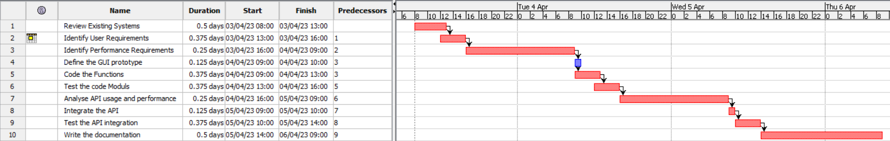

# Project Estimation - CURRENT

Date: 10/04/2023

Version: V1 - Estimations of EZWallet in CURRENT form (as received by teachers)

# Estimate by size

NOTE: Calculations performed assuming each person works 8 hours per day, 5 days a week.

| Element                 | Estimate  |
| :---------------------- | :-------: |
| Number of Classes       | 3 Classes |
| Average Size of classes |  83 LOC   |
| Total Expected Size     |  249 LOC  |
| Expected Effort         |   25 PH   |
| Expected Cost           |   750 €   |
| Estimated calendar time |  1 week   |

# Estimate by product decomposition

| Component name       | Estimated effort (person hours) |
| :------------------- | :-----------------------------: |
| Requirement document |              7 PH               |
| GUI prototype        |              1 PH               |
| Code                 |              3 PH               |
| Unit tests           |              3 PH               |
| API tests            |              6 PH               |
| Management documents |              4 PH               |

# Estimate by activity decomposition

| Activity name                     | Estimated effort (person hours) |
| :-------------------------------- | :-----------------------------: |
| Review existing systems           |              4 PH               |
| Identify user requirements        |              3 PH               |
| Identify performance requirements |              2 PH               |
| Define the GUI prototype          |              1 PH               |
| Code the functions                |              3 PH               |
| Test the code modules             |              3 PH               |
| Analyse API usage and performance |              2 PH               |
| Integrate the API                 |              1 PH               |
| Test the API integration          |              3 PH               |
| Write the documentation           |              4 PH               |

## Gantt Chart

# Summary

After performing the three estimations, we got a total hour count of 25 Person Hours for the Estimation by Size, of 24 Person Hours for the Estimation by product decomposition, and of 26 Person Hours for the Estimation by Activity Decomposition.

The total estimation times differ by 1 or 2 PH. This may be because of the specificity of the methods, as the estimation by activity decomposition goes further into the details so the time increases. On the other hand, we have the estimation by product decomposition, in which the elements described are more generic, so the time estimation is more subjected to personal interpretation of the difficulty of the task.

Finally, we have the estimation by size which is a more structured method, and can be based on the actual lines of code, so this can help as a guide to a more accurate time estimation.

|                                    | Estimated effort | Estimated duration |
| :--------------------------------- | :--------------: | :----------------: |
| Estimate by size                   |      25 PH       |      3,2 Days      |
| Estimate by product decomposition  |      24 PH       |       3 Days       |
| Estimate by activity decomposition |      26 PH       |     3,25 Days      |
