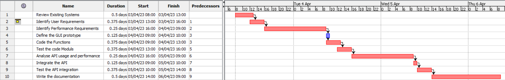

# Project Estimation - FUTURE

Date: 26/04/2023

Version: V2 - description of EZWallet in FUTURE form (as proposed by the team)

# Estimate by size

NOTE: Calculations performed assuming each person works 8 hours per day, 5 days a week.

| Element                 | Estimate  |
| :---------------------- | :-------: |
| Number of Classes       | 4 Classes |
| Average Size of classes |  150 LOC  |
| Total Expected Size     |  600 LOC  |
| Expected Effort         |   60 PH   |
| Expected Cost           |  1,800 €  |
| Estimated calendar time | 1.5 weeks |

# Estimate by product decomposition

| Component name       | Estimated effort (person hours) |
| :------------------- | :-----------------------------: |
| Requirement document |              7 PH               |
| GUI prototype        |              4 PH               |
| Code                 |              20 PH              |
| Unit tests           |              10 PH              |
| API tests            |              16 PH              |
| Management documents |              6 PH               |

# Estimate by activity decomposition

| Activity name                     | Estimated effort (person hours) |
| :-------------------------------- | :-----------------------------: |
| Review existing systems           |              6 PH               |
| Identify user requirements        |              4 PH               |
| Identify performance requirements |              3 PH               |
| Define the GUI prototype          |              4 PH               |
| Code the functions                |              20 PH              |
| Test the code modules             |              10 PH              |
| Analyse API usage and performance |              4 PH               |
|  Integrate the API                |              12 PH              |
| Test the API integration          |              4 PH               |
| Write the documentation           |              4 PH               |

## Gantt Chart

# Summary

After performing the three estimations, we got a total hour count of 60 Person Hours for the Estimation by Size, of 63 Person Hours for the Estimation by product decomposition, and of 71 Person Hours for the Estimation by Activity Decomposition.

The total estimation time for the V2 has a much higher variance, showing a difference between cases of up to 11 PH . This may be related to both the specificity of the methods and the uncertainty regarding the actual development of the application due to our limited experience in the field. As the estimation methods get more generic, the estimated time varies a lot. For the first method, as we have an almost complete formula based on the estimated LOC, the time is easily and precisely estimated. For the other two methods, since we are forced to make assumptions about the time required by some components, the projected duration of the project tends to vary wildly based on each person's experience and subjectivity.

Finally, taking into account all of this, we can estimate that the time needed to finish the project to be around 65 PH.

|                                    | Estimated effort | Estimated duration |
| :--------------------------------- | :--------------: | :----------------: |
| Estimate by size                   |      60 PH       |      7,5 days      |
| Estimate by product decomposition  |      63 PH       |      7,9 days      |
| Estimate by activity decomposition |      71 PH       |      8,9 days      |
