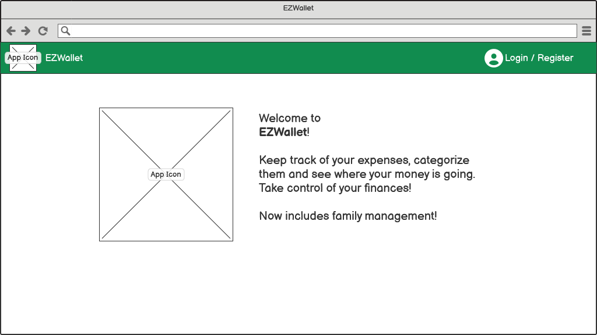

# Graphical User Interface Prototype - FUTURE

Authors: Giuseppe Silvestri

Date: 15/04/2023

Version: V2 - description of EZWallet in FUTURE form (as proposed by the team)

NOTE: in the images "App Icon" is used as a placeholder for EZWallet's logo, which has not been defined yet.

## Homepage

Clicking "Login / Register" leads to the [login page](#login-page).

## Login Page

- Clicking "Homepage" leads to the [homepage](#homepage);
- clicking "Register" leads to the [registration page](#registration-page);
- clicking "Login" (assuming the credentials are correct) leads to the:
  - [transactions page](#transactions-page) if a user logged in;
  - [admin account page](#admin-page) if an admin logged in;
  - [COO account page](#coo-page) if the COO logged in.

## Registration Page

- Clicking "Register" (assuming the creation of the account is allowed) leads to the [transactions page](#transactions-page);
- clicking "Log in" leads to the [login page](#login-page).

## Transactions Page

NOTE: the transactions are actually the **labels**, which are comprised of transaction amount, name, **date** and the colour of the transaction's category. To get the list of transactions, the API should be used.

- Clicking "My account" leads to the [user account page](#user-account-page);
- clicking "Go to categories" leads to the [categories page](#categories-page).

## Categories Page

- Clicking "My account" leads to the [user account page](#user-account-page);
- clicking "Go to transactions" leads to the [transactions page](#transactions-page).

## User Account Page

### Without family

### With family

- Clicking "My wallet" leads to the [transactions page](#transactions-page);
- clicking "Log out" leads to the [homepage](#homepage).

## Admin Page

Clicking "Log out" leads to the [homepage](#homepage).

## COO Page

Clicking "Log out" leads to the [homepage](#homepage).
