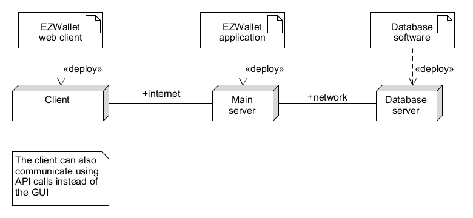

# Requirements Document - current EZWallet

Date: 17/04/2023

Version: V1 - description of EZWallet in CURRENT form (as received by teachers)

| Version number | Change                                                                                                                                                                                                                                                            |
| :------------: | :---------------------------------------------------------------------------------------------------------------------------------------------------------------------------------------------------------------------------------------------------------------- |
|      0.1       | Added [stakeholders](#stakeholders)  Added [context diagram and interfaces](#context-diagram-and-interfaces)  Added [functional requirements](#functional-and-non-functional-requirements)                                                                |
|      0.2       | Updated [context diagram](#context-diagram)  Added [stories and personas](#stories-and-personas)  Added [non-functional requirements](#non-functional-requirements)  Added [use cases 1 to 4](#use-case-1-uc1-create-account)  Formatted document |
|      0.3       | Added [use cases 5 to 7](#use-case-5-uc5-handle-categories)  Added [use case diagram](#use-case-diagram)  Added [glossary](#glossary)  Added [system design](#system-design)  Added [deployment diagram](#deployment-diagram)                     |
|       1        | Updated [non-functional requirements](#non-functional-requirements) Updated [table of contents](#contents) Formatted document                                                                                                                             |
|      1.1       | Removed mentions of the software being usable only via API calls Updated [deployment diagram](#deployment-diagram)  Added actors involved in [use cases](#use-cases)  Updated scenario names in [use cases](#use-cases)                               |
|      1.2       | Updated [deployment diagram](#deployment-diagram)                                                                                                                                                                                                                 |
|      1.3       | Changed wording of [functional requirements](#functional-requirements)                                                                                                                                                                                            |

# Contents

- [Informal description](#informal-description)
- [Stakeholders](#stakeholders)
- [Context Diagram and interfaces](#context-diagram-and-interfaces)
  - [Context Diagram](#context-diagram)
  - [Interfaces](#interfaces)
- [Stories and personas](#stories-and-personas)
- [Functional and non functional requirements](#functional-and-non-functional-requirements)
  - [Functional Requirements](#functional-requirements)
  - [Non functional requirements](#non-functional-requirements)
- [Use case diagram and use cases](#use-case-diagram-and-use-cases)
  - [Use case diagram](#use-case-diagram)
  - [Use cases](#use-cases)
- [Glossary](#glossary)
- [System design](#system-design)
- [Deployment diagram](#deployment-diagram)

# Informal description

EZWallet (read EaSy Wallet) is a software application designed to help individuals and families keep track of their expenses. Users can enter and categorize their expenses, allowing them to quickly see where their money is going. EZWallet is a powerful tool for those looking to take control of their finances and make informed decisions about their spending.

# Stakeholders

NOTE: the software is completely free: the are no subscriptions or advertisements.

| Stakeholder name              |                     Description                      |
| ----------------------------- | :--------------------------------------------------: |
| User                          | Family member / individual that uses the application |
| Admin                         |  A maintainer of the system, with privileged access  |
| Chief Operating Officer (COO) |         Person in charge of the whole system         |

# Context Diagram and interfaces

## Context Diagram

## Interfaces

NOTE: there is no privilege distinction between the actors, and they're collectively referred to as "superusers".

| Actor | Logical Interface |                Physical Interface                 |
| :---- | :---------------: | :-----------------------------------------------: |
| User  |     GUI, API      | Internet connection, keyboard, mouse, touchscreen |
| Admin |     GUI, API      | Internet connection, keyboard, mouse, touchscreen |
| COO   |     GUI, API      | Internet connection, keyboard, mouse, touchscreen |

# Stories and personas

- Persona 1: student, female, single, 22 year old

  - Story: is on a tight budget, has just bought groceries and wants to keep track of her expenses.

- Persona 2: worker, male, married, 35 year old

  - Story: wants to save money for a trip, so wants to know how he and his wife spend money and where they can save some.

- Persona 3: administrator
  - Story: wants to know the number of people that are using the application.

# Functional and non functional requirements

## Functional Requirements

| ID                  | Description                 |
| :------------------ | :-------------------------- |
| FR1                 | Manage Account              |
| &emsp; FR1.1 &emsp; | &emsp; Create               |
| &emsp; FR1.2        | &emsp; Login                |
| &emsp; FR1.3        | &emsp; Logout               |
| FR2                 | Manage Transaction          |
| &emsp; FR2.1        | &emsp; Create               |
| &emsp; FR2.2        | &emsp; Delete               |
| FR3                 | Show Transactions           |
| FR4                 | Create Transaction Category |
| FR5                 | Show Transaction Categories |
| FR6                 | Show Labels                 |
| FR7                 | Show Users List             |

## Non Functional Requirements

| ID   |       Type       | Description                                                              | Refers to |
| ---- | :--------------: | :----------------------------------------------------------------------- | --------: |
| NFR1 |    Usability     | All functions should be usable with minimal cellphone/computer knowledge |   All FRs |
| NFR2 |   Portability    | The application should be accessible from any internet-enabled device    |   All FRs |
| NFR3 | Interoperability | Transactions should be currency-independent                              |     FR2-3 |
| NFR4 | Interoperability | Transactions should represent both incomes and expenses                  |     FR2-3 |
| NFR5 |    Efficiency    | Fetching the transactions should take less than 0.5 seconds              |       FR3 |
| NFR6 |     Security     | Account passwords should not be saved in plaintext                       |       FR1 |

# Use case diagram and use cases

## Use case diagram

## Use cases

### Use case 1, UC1 - Create account

| Actors Involved  |                                 Superuser                                 |
| ---------------- | :-----------------------------------------------------------------------: |
| Precondition     |                    Superuser does not have an account                     |
| Post condition   |                         Superuser has an account                          |
| Nominal Scenario |                     The superuser creates an account                      |
| Exceptions       | The email used to create the account is already linked to another account |

|  Scenario 1.1  |                       Successfully create account                       |
| :------------: | :---------------------------------------------------------------------: |
|  Precondition  |                   Superuser does not have an account                    |
| Post condition |                        Superuser has an account                         |
|   **Step #**   |                             **Description**                             |
|       1        |                    Superuser asks to create account                     |
|       2        |                System asks for username, email, password                |
|       3        |               Superuser enters username, email, password                |
|       4        | System checks if the used email is linked to another account: it is not |
|       5        |                       System creates the account                        |

|  Scenario 1.2  |                        Cannot create account                        |
| :------------: | :-----------------------------------------------------------------: |
|  Precondition  |                 Superuser does not have an account                  |
| Post condition |                 Superuser does not have an account                  |
|   **Step #**   |                           **Description**                           |
|       1        |                  Superuser asks to create account                   |
|       2        |              System asks for username, email, password              |
|       3        |             Superuser enters username, email, password              |
|       4        | System checks if the used email is linked to another account: it is |
|       5        |    System does not create the account and shows an error message    |

### Use case 2, UC2 - Log in

| Actors Involved  |                                          Superuser                                           |
| ---------------- | :------------------------------------------------------------------------------------------: |
| Precondition     |                                Superuser does have an account                                |
| Post condition   |                                    Superuser is logged in                                    |
| Nominal Scenario |                            The superuser logs into their account                             |
| Variants         |                              The superuser is already logged in                              |
| Exceptions       | There is no account linked to the superuser's email;   the superuser's password is wrong |

|  Scenario 2.1  |                      Successfully logged in                       |
| :------------: | :---------------------------------------------------------------: |
|  Precondition  |        Superuser does have an account but is not logged in        |
| Post condition |                      Superuser is logged in                       |
|   **Step #**   |                          **Description**                          |
|       1        |             Superuser asks to log into their account              |
|       2        |                  System asks for email, password                  |
|       3        |                 Superuser enters email, password                  |
|       4        |     System checks if the email is linked to an account: it is     |
|       5        | System checks if the superuser is already logged in: they are not |
|       6        |          System checks if the password is correct: it is          |
|       7        |                    The superuser is logged in                     |

|  Scenario 2.2  |                           Already logged in                            |
| :------------: | :--------------------------------------------------------------------: |
|  Precondition  |            Superuser does have an account and is logged in             |
| Post condition |                         Superuser is logged in                         |
|   **Step #**   |                            **Description**                             |
|       1        |                Superuser asks to log into their account                |
|       2        |                    System asks for email, password                     |
|       3        |                    Superuser enters email, password                    |
|       4        |       System checks if the email is linked to an account: it is        |
|       5        |     System checks if the superuser is already logged in: they are      |
|       6        | System sends a message warning the superuser they're already logged in |

|  Scenario 2.3  |                                 Log into non-existing account                                 |
| :------------: | :-------------------------------------------------------------------------------------------: |
|  Precondition  |                                Superuser does have an account                                 |
| Post condition |                                  Superuser is not logged in                                   |
|   **Step #**   |                                        **Description**                                        |
|       1        |                           Superuser asks to log into their account                            |
|       2        |                                System asks for email, password                                |
|       3        |                               Superuser enters email, password                                |
|       4        |                 System checks if the email is linked to an account: it is not                 |
|       5        | System sends an error message warning the superuser their email is not linked to any accounts |

|  Scenario 2.4  |                      Login with incorrect credentials                       |
| :------------: | :-------------------------------------------------------------------------: |
|  Precondition  |                       Superuser does have an account                        |
| Post condition |                         Superuser is not logged in                          |
|   **Step #**   |                               **Description**                               |
|       1        |                  Superuser asks to log into their account                   |
|       2        |                       System asks for email, password                       |
|       3        |                      Superuser enters email, password                       |
|       4        |          System checks if the email is linked to an account: it is          |
|       5        |      System checks if the superuser is already logged in: they are not      |
|       6        |             System checks if the password is correct: it is not             |
|       7        | System sends an error message warning the superuser their password is wrong |

### Use case 3, UC3 - Log out

| Actors Involved  |                Superuser                |
| ---------------- | :-------------------------------------: |
| Precondition     |         Superuser is logged in          |
| Post condition   |       Superuser is not logged in        |
| Nominal Scenario | The superuser logs out of their account |
| Variants         |  The superuser has already logged out   |
| Exceptions       | There is no account to be logged out of |

|  Scenario 3.1  |               Successfully logged out                |
| :------------: | :--------------------------------------------------: |
|  Precondition  |                Superuser is logged in                |
| Post condition |              Superuser is not logged in              |
|   **Step #**   |                   **Description**                    |
|       1        |         Superuser requests to be logged out          |
|       2        | System checks if a superuser session exists: it does |
|       3        |    Systems checks if the account exists: it does     |
|       4        |            System logs the superuser out             |

|  Scenario 3.2  |                     Already logged out                      |
| :------------: | :---------------------------------------------------------: |
|  Precondition  |                 Superuser is not logged in                  |
| Post condition |                 Superuser is not logged in                  |
|   **Step #**   |                       **Description**                       |
|       1        |             Superuser requests to be logged out             |
|       2        |  System checks if a superuser session exists: it does not   |
|       3        | System warns the superuser that they are already logged out |

|  Scenario 3.3  |                        Logout without a valid account                         |
| :------------: | :---------------------------------------------------------------------------: |
|  Precondition  |                        Superuser has no valid account                         |
| Post condition |                          Superuser is not logged in                           |
|   **Step #**   |                                **Description**                                |
|       1        |                      Superuser requests to be logged out                      |
|       2        |             System checks if a superuser session exists: it does              |
|       3        |               Systems checks if the account exists: it does not               |
|       3        | System warns the superuser that the account to be logged out of was not found |

### Use case 4, UC4 - Manage transactions

| Actors Involved  |                                                                              Superuser                                                                               |
| ---------------- | :------------------------------------------------------------------------------------------------------------------------------------------------------------------: |
| Precondition     |                                                                        Superuser is logged in                                                                        |
| Post condition   |                                                                The requested operation was successful                                                                |
| Nominal Scenario |                                                     The superuser requests to perform an action on a transaction                                                     |
| Variants         | The action requested is the creation of a transaction; the action requested is viewing all transactions;   the action requested is the deletion of a transaction |
| Exceptions       |                                                                    The superuser is not logged in                                                                    |

|  Scenario 4.1  |                   Create a transaction                    |
| :------------: | :-------------------------------------------------------: |
|  Precondition  |                  Superuser is logged in                   |
| Post condition |                  Transaction is created                   |
|   **Step #**   |                      **Description**                      |
|       1        |      Superuser requests a transaction to be created       |
|       2        | Superuser enters name, amount and type of the transaction |
|       3        |   System checks if the superuser is logged in: they are   |
|       4        |              System creates the transaction               |

|  Scenario 4.2  |             Get list of all transactions              |
| :------------: | :---------------------------------------------------: |
|  Precondition  |                Superuser is logged in                 |
| Post condition |            Transactions list is displayed             |
|   **Step #**   |                    **Description**                    |
|       1        |      Superuser requests to view the transactions      |
|       2        | System checks if the superuser is logged in: they are |
|       3        |       System sends the list of all transactions       |

|  Scenario 4.3  |                 Delete a transaction                  |
| :------------: | :---------------------------------------------------: |
|  Precondition  |                Superuser is logged in                 |
| Post condition |                Transaction is deleted                 |
|   **Step #**   |                    **Description**                    |
|       1        |      Superuser requests to delete a transaction       |
|       2        |      Superuser enters the ID of the transaction       |
|       3        | System checks if the superuser is logged in: they are |
|       4        |            System deletes the transaction             |

|  Scenario 4.4  |     Perform an operation on transactions without login      |
| :------------: | :---------------------------------------------------------: |
|  Precondition  |                 Superuser is not logged in                  |
| Post condition |                    Operation is aborted                     |
|   **Step #**   |                       **Description**                       |
|       1        | Superuser requests to perform an operation on a transaction |
|       2        |     Superuser enters the required information (if any)      |
|       3        |  System checks if the superuser is logged in: they are not  |
|       4        |   System warns the superuser that they are not logged in    |

### Use case 5, UC5 - Handle categories

| Actors Involved  |                                                Superuser                                                 |
| ---------------- | :------------------------------------------------------------------------------------------------------: |
| Precondition     |                                          Superuser is logged in                                          |
| Post condition   |                                  The requested operation was successful                                  |
| Nominal Scenario |                        The superuser requests to perform an action on a category                         |
| Variants         | The action requested is the creation of a category;   the action requested is viewing all categories |
| Exceptions       |                                      The superuser is not logged in                                      |

|  Scenario 5.1  |                   Create a category                   |
| :------------: | :---------------------------------------------------: |
|  Precondition  |                Superuser is logged in                 |
| Post condition |                  Category is created                  |
|   **Step #**   |                    **Description**                    |
|       1        |      Superuser requests a category to be created      |
|       2        |   Superuser enters type and colour of the category    |
|       3        | System checks if the superuser is logged in: they are |
|       4        |              System creates the category              |

|  Scenario 5.2  |              Get list of all categories               |
| :------------: | :---------------------------------------------------: |
|  Precondition  |                Superuser is logged in                 |
| Post condition |              Category list is displayed               |
|   **Step #**   |                    **Description**                    |
|       1        |       Superuser requests to view the categories       |
|       2        | System checks if the superuser is logged in: they are |
|       3        |        System sends the list of all categories        |

|  Scenario 5.3  |     Perform an operation on categories without login      |
| :------------: | :-------------------------------------------------------: |
|  Precondition  |                Superuser is not logged in                 |
| Post condition |                   Operation is aborted                    |
|   **Step #**   |                      **Description**                      |
|       1        | Superuser requests to perform an operation on a category  |
|       2        |    Superuser enters the required information (if any)     |
|       3        | System checks if the superuser is logged in: they are not |
|       4        |  System warns the superuser that they are not logged in   |

### Use case 6, UC6 - Show labels

| Actors Involved  |               Superuser               |
| ---------------- | :-----------------------------------: |
| Precondition     |        Superuser is logged in         |
| Post condition   |       Labels list is displayed        |
| Nominal Scenario | Superuser requests to view the labels |
| Exceptions       |    The superuser is not logged in     |

|  Scenario 6.1  |                Get list of all labels                 |
| :------------: | :---------------------------------------------------: |
|  Precondition  |                Superuser is logged in                 |
| Post condition |               Labels list is displayed                |
|   **Step #**   |                    **Description**                    |
|       1        |         Superuser requests to view the labels         |
|       2        | System checks if the superuser is logged in: they are |
|       3        |          System sends the list of all labels          |

|  Scenario 6.2  |           Get list of all labels without login            |
| :------------: | :-------------------------------------------------------: |
|  Precondition  |                  Superuser is logged in                   |
| Post condition |                   Operation is aborted                    |
|   **Step #**   |                      **Description**                      |
|       1        |           Superuser requests to view the labels           |
|       2        | System checks if the superuser is logged in: they are not |
|       3        |  System warns the superuser that they are not logged in   |

### Use case 7, UC7 - Show users list

| Actors Involved  |                  Superuser                   |
| ---------------- | :------------------------------------------: |
| Precondition     |            Superuser is logged in            |
| Post condition   |           Users list is displayed            |
| Nominal Scenario | Superuser requests to view the list of users |
| Exceptions       |        The superuser is not logged in        |

|  Scenario 7.1  |                 Get list of all users                 |
| :------------: | :---------------------------------------------------: |
|  Precondition  |                Superuser is logged in                 |
| Post condition |                Users list is displayed                |
|   **Step #**   |                    **Description**                    |
|       1        |       Superuser requests to view the users list       |
|       2        | System checks if the superuser is logged in: they are |
|       3        |          System sends the list of all users           |

|  Scenario 7.2  |            Get list of all users without login            |
| :------------: | :-------------------------------------------------------: |
|  Precondition  |                  Superuser is logged in                   |
| Post condition |                   Operation is aborted                    |
|   **Step #**   |                      **Description**                      |
|       1        |         Superuser requests to view the users list         |
|       2        | System checks if the superuser is logged in: they are not |
|       3        |  System warns the superuser that they are not logged in   |

# Glossary

# System Design

# Deployment Diagram

