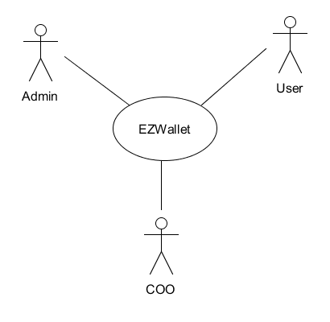
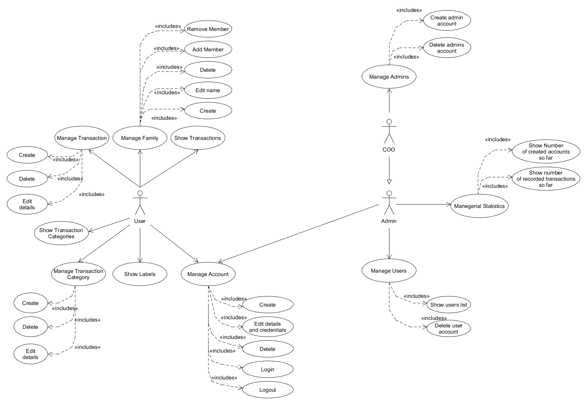
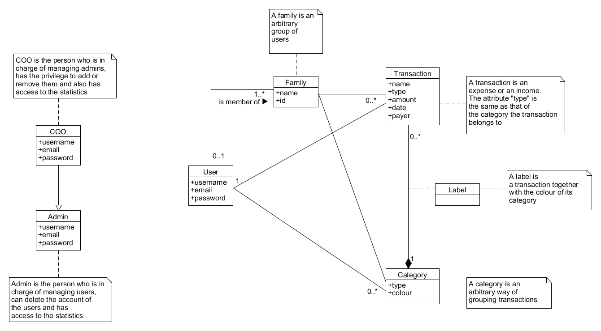
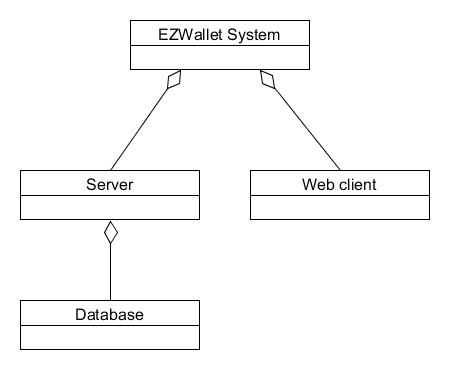
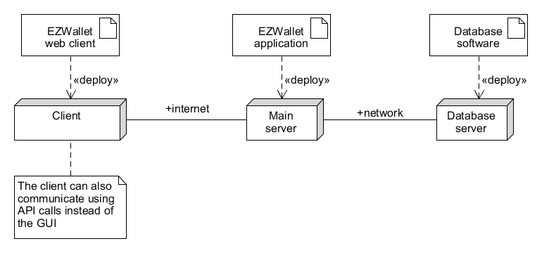

# Requirements Document - future EZWallet

Date: 26/04/2023

Version: V2 - description of EZWallet in FUTURE form (as proposed by the team)

| Version number | Change                                                                                                                                                                                                                                              |
| -------------- | :-------------------------------------------------------------------------------------------------------------------------------------------------------------------------------------------------------------------------------------------------- |
| 0.1            | Forked requirements document V1                                                                                                                                                                                                                     |
| 0.2            | Updated [context diagram](#context-diagram)  Expanded [functional requirements](#functional-requirements)  Added [non functional requirements 6-7](#non-functional-requirements)                                                            |
| 0.3            | Updated [use case diagram](#use-case-diagram)  Added and expanded [use cases 4, 5, 9, 10, 11, 12](#use-cases)                                                                                                                                   |
| 0.4            | Updated [use case scenarios](#use-cases)                                                                                                                                                                                                            |
| 1              | Updated [glossary](#glossary)                                                                                                                                                                                                                       |
| 1.1            | Updated [functional and non functional requirements](#functional-and-non-functional-requirements) Updated [use cases](#use-cases)  Updated [use case diagram](#use-case-diagram)  Updated [glossary](#glossary)  Formatted document |
| 1.2            | Updated [table of contents](#contents)  Added [table of access rights](#table-of-access-rights)                                                                                                                                                 |
| 1.3            | Added [stories 4 to 6](#stories-and-personas)                                                                                                                                                                                                       |

# Contents

- [Informal description](#informal-description)
- [Stakeholders](#stakeholders)
- [Context Diagram and interfaces](#context-diagram-and-interfaces)
  - [Context Diagram](#context-diagram)
  - [Interfaces](#interfaces)
- [Stories and personas](#stories-and-personas)
- [Functional and non functional requirements](#functional-and-non-functional-requirements)
  - [Functional Requirements](#functional-requirements)
  - [Table of access rights](#table-of-access-rights)
  - [Non functional requirements](#non-functional-requirements)
- [Use case diagram and use cases](#use-case-diagram-and-use-cases)
  - [Use case diagram](#use-case-diagram)
  - [Use cases](#use-cases)
- [Glossary](#glossary)
- [System design](#system-design)
- [Deployment diagram](#deployment-diagram)

# Informal description

EZWallet (read EaSy Wallet) is a software application designed to help individuals and families keep track of their expenses. Users can enter and categorize their expenses, allowing them to quickly see where their money is going. EZWallet is a powerful tool for those looking to take control of their finances and make informed decisions about their spending.

# Stakeholders

NOTE: the software is completely free: the are no subscriptions or advertisements.

| Stakeholder name              |                     Description                      |
| ----------------------------- | :--------------------------------------------------: |
| User                          | Family member / individual that uses the application |
| Admin                         |  A maintainer of the system, with privileged access  |
| Chief Operating Officer (COO) |         Person in charge of the whole system         |

# Context Diagram and interfaces

## Context Diagram

## Interfaces

NOTE: user, admin and COO are collectively referred to as "end user".

| Actor | Logical Interface |                Physical Interface                 |
| :---- | :---------------: | :-----------------------------------------------: |
| User  |     GUI, API      | Internet connection, keyboard, mouse, touchscreen |
| Admin |     GUI, API      | Internet connection, keyboard, mouse, touchscreen |
| COO   |     GUI, API      | Internet connection, keyboard, mouse, touchscreen |

# Stories and personas

- Persona 1: student, female, single, 22 year old

  - Story: is on a tight budget, has just bought groceries and wants to keep track of her expenses.

- Persona 2: worker, male, married, 35 year old

  - Story: wants to save money for a trip, so wants to know how he and his wife spend money and where they can save some.

- Persona 3: engineer, male, married with children, 45 year old

  - Story: wants to create a family to keep track of his children's expenses

- Persona 4: professor, female, married with child, 55 year old

  - Story: wants to remove her child from the family since they're now financially independent

- Persona 5: writer, male, single, 50 year old

  - Story: wants to record the editor's royalty payments

- Persona 6: administrator

  - Story: wants to know the number of people that are using the application.

- Persona 7: COO

  - Story: has just hired a new admin and wants to create their account

# Functional and non functional requirements

## Functional Requirements

| ID                  | Description                                        |
| :------------------ | :------------------------------------------------- |
| FR1                 | Manage Account                                     |
| &emsp; FR1.1 &emsp; | &emsp; Create                                      |
| &emsp; FR1.2        | &emsp; Login                                       |
| &emsp; FR1.3        | &emsp; Logout                                      |
| &emsp; FR1.4        | &emsp; Edit details and credentials                |
| &emsp; FR1.5        | &emsp; Delete                                      |
| FR2                 | Manage Transaction                                 |
| &emsp; FR2.1        | &emsp; Create transaction (individual/family)      |
| &emsp; FR2.2        | &emsp; Delete transaction                          |
| &emsp; FR2.3        | &emsp; Edit details                                |
| FR3                 | Show Transactions                                  |
| &emsp; FR3.1        | &emsp; Sorted by amount/date                       |
| &emsp; FR3.2        | &emsp; Filtered by family/individual               |
| FR4                 | Manage Transaction Category                        |
| &emsp; FR4.1        | &emsp; Create                                      |
| &emsp; FR4.2        | &emsp; Delete                                      |
| &emsp; FR4.3        | &emsp; Edit details                                |
| FR5                 | Show Transaction Categories                        |
| &emsp; FR5.1        | &emsp; Sorted by aggregated transactions' amount   |
| &emsp; FR5.2        | &emsp; Sorted by name                              |
| FR6                 | Show Labels                                        |
| FR7                 | Manage Family                                      |
| &emsp; FR7.1        | &emsp; Create                                      |
| &emsp; FR7.2        | &emsp; Delete                                      |
| &emsp; FR7.3        | &emsp; Edit name                                   |
| &emsp; FR7.4        | &emsp; Add member                                  |
| &emsp; FR7.5        | &emsp; Remove member                               |
| FR8                 | Manage Users                                       |
| &emsp; FR8.1        | &emsp; Show users list                             |
| &emsp; FR8.2        | &emsp; Delete user account                         |
| FR9                 | Manage Admins                                      |
| &emsp; FR9.1        | &emsp; Create admin account                        |
| &emsp; FR9.2        | &emsp; Delete admin account                        |
| FR10                | Managerial Statistics                              |
| &emsp; FR10.1       | &emsp; Show number of created accounts so far      |
| &emsp; FR10.2       | &emsp; Show number of recorded transactions so far |

## Table of access rights

|   Function   | User |                  Admin                  |                COO                |
| :----------: | :--: | :-------------------------------------: | :-------------------------------: |
|     FR1      | yes  | partially (can change own password) | yes (can change own password) |
|  FR2 to FR7  | yes  |                   no                    |                no                 |
| FR8 and FR10 |  no  |                   yes                   |                yes                |
|     FR9      |  no  |                   no                    |                yes                |

## Non Functional Requirements

| ID   |       Type       | Description                                                                        | Refers to |
| ---- | :--------------: | :--------------------------------------------------------------------------------- | --------: |
| NFR1 |    Usability     | All functions should be usable with minimal cellphone/computer knowledge           |   All FRs |
| NFR2 |   Portability    | The application should be accessible from any internet-enabled device              |   All FRs |
| NFR3 | Interoperability | Transactions should be currency-independent                                        |     FR2-3 |
| NFR4 | Interoperability | Transactions should represent both incomes and expenses                            |     FR2-3 |
| NFR5 |    Efficiency    | Fetching the transactions should take less than 0.5 seconds                        |       FR3 |
| NFR6 |     Security     | Account passwords should not be saved in plaintext                                 |       FR1 |
| NFR7 |     Privacy      | Individual's information and data should not be visible or accessible to non-users |      FR10 |

# Use case diagram and use cases

## Use case diagram

## Use cases

### Use case 1, UC1 - Create account

| Actors Involved  |                                   User                                    |
| ---------------- | :-----------------------------------------------------------------------: |
| Precondition     |                       User does not have an account                       |
| Post condition   |                            User has an account                            |
| Nominal Scenario |                        The user creates an account                        |
| Exceptions       | The email used to create the account is already linked to another account |

|  Scenario 1.1  |                       Successfully create account                       |
| :------------: | :---------------------------------------------------------------------: |
|  Precondition  |                      User does not have an account                      |
| Post condition |                           User has an account                           |
|   **Step #**   |                             **Description**                             |
|       1        |                       User asks to create account                       |
|       2        |                System asks for username, email, password                |
|       3        |                  User enters username, email, password                  |
|       4        | System checks if the used email is linked to another account: it is not |
|       5        |                       System creates the account                        |

|  Scenario 1.2  |                        Cannot create account                        |
| :------------: | :-----------------------------------------------------------------: |
|  Precondition  |                    User does not have an account                    |
| Post condition |                    User does not have an account                    |
|   **Step #**   |                           **Description**                           |
|       1        |                     User asks to create account                     |
|       2        |              System asks for username, email, password              |
|       3        |                User enters username, email, password                |
|       4        | System checks if the used email is linked to another account: it is |
|       5        |    System does not create the account and shows an error message    |

### Use case 2, UC2 - Log in

| Actors Involved  |                              User, admin, COO                               |
| ---------------- | :-------------------------------------------------------------------------: |
| Precondition     |                           End user has an account                           |
| Post condition   |                            End user is logged in                            |
| Nominal Scenario |                      End user logs into their account                       |
| Variants         |                      The End user is already logged in                      |
| Exceptions       | There is no account linked to the user's email;   the password is wrong |

|  Scenario 2.1  |                    Successfully logged in                    |
| :------------: | :----------------------------------------------------------: |
|  Precondition  |         End user has an account but is not logged in         |
| Post condition |                    End user is logged in                     |
|   **Step #**   |                       **Description**                        |
|       1        |           End user asks to log into their account            |
|       2        |               System asks for email, password                |
|       3        |               End user enters email, password                |
|       4        |  System checks if the email is linked to an account: it is   |
|       5        | System checks if the user is already logged in: they are not |
|       6        |       System checks if the password is correct: it is        |
|       7        |                  The End user is logged in                   |

|  Scenario 2.2  |                         Already logged in                         |
| :------------: | :---------------------------------------------------------------: |
|  Precondition  |             End user has an account and is logged in              |
| Post condition |                       End user is logged in                       |
|   **Step #**   |                          **Description**                          |
|       1        |              End user asks to log into their account              |
|       2        |                  System asks for email, password                  |
|       3        |                  End user enters email, password                  |
|       4        |     System checks if the email is linked to an account: it is     |
|       5        |     System checks if the user is already logged in: they are      |
|       6        | System sends a message warning the user they're already logged in |

|  Scenario 2.3  |                              Log into non-existing account                               |
| :------------: | :--------------------------------------------------------------------------------------: |
|  Precondition  |                                 End user has an account                                  |
| Post condition |                                End user is not logged in                                 |
|   **Step #**   |                                     **Description**                                      |
|       1        |                         End user asks to log into their account                          |
|       2        |                             System asks for email, password                              |
|       3        |                             End user enters email, password                              |
|       4        |              System checks if the email is linked to an account: it is not               |
|       5        | System sends an error message warning the user their email is not linked to any accounts |

|  Scenario 2.4  |                    Login with incorrect credentials                    |
| :------------: | :--------------------------------------------------------------------: |
|  Precondition  |                        End user has an account                         |
| Post condition |                       End user is not logged in                        |
|   **Step #**   |                            **Description**                             |
|       1        |                End user asks to log into their account                 |
|       2        |                    System asks for email, password                     |
|       3        |                    End user enters email, password                     |
|       4        |       System checks if the email is linked to an account: it is        |
|       5        |    System checks if the end user is already logged in: they are not    |
|       6        |          System checks if the password is correct: it is not           |
|       7        | System sends an error message warning the user their password is wrong |

### Use case 3, UC3 - Log out

| Actors Involved  |            User, admin, COO            |
| ---------------- | :------------------------------------: |
| Precondition     |         End user is logged in          |
| Post condition   |       End user is not logged in        |
| Nominal Scenario | The end user logs out of their account |
| Variants         |  The end user has already logged out   |
| Exceptions       |                                        |

|  Scenario 3.1  |             Successfully logged out             |
| :------------: | :---------------------------------------------: |
|  Precondition  |              End user is logged in              |
| Post condition |            End user is not logged in            |
|   **Step #**   |                 **Description**                 |
|       1        |       End user requests to be logged out        |
|       2        | System checks if a user session exists: it does |
|       3        |  Systems checks if the account exists: it does  |
|       4        |          System logs the end user out           |

|  Scenario 3.2  |                     Already logged out                     |
| :------------: | :--------------------------------------------------------: |
|  Precondition  |                 End user is not logged in                  |
| Post condition |                 End user is not logged in                  |
|   **Step #**   |                      **Description**                       |
|       1        |             End user requests to be logged out             |
|       2        |    System checks if a user session exists: it does not     |
|       3        | System warns the end user that they are already logged out |

### Use case 4, UC4 - Edit account

| Actors Involved  |                            User, admin, COO                             |
| ---------------- | :---------------------------------------------------------------------: |
| Precondition     |                          End user is logged in                          |
| Post condition   | End user is still logged in, end user account's information has changed |
| Nominal Scenario |              End user changes information of their account              |
| Variants         |               Edit password;  edit other information                |
| Exceptions       |                          The password is wrong                          |

|  Scenario 4.1  |        Account information successfully edited        |
| :------------: | :---------------------------------------------------: |
|  Precondition  |                 End user is logged in                 |
| Post condition | End user is still logged in, information has changed  |
|   **Step #**   |                    **Description**                    |
|       1        |            End user input new information             |
|       2        |         End user requests to save the changes         |
|       3        |       System saves the new entered information        |
|       4        | End user profile page is updated with new information |

|  Scenario 4.2  |                  Editing password                   |
| :------------: | :-------------------------------------------------: |
|  Precondition  |                End user is logged in                |
| Post condition |  End user is still logged in, password has changed  |
|   **Step #**   |                   **Description**                   |
|       1        |    End user types old password and new password     |
|       2        |        End user requests to save the changes        |
|       3        | System checks if the old password is correct: it is |
|       4        |        System updated the end user password         |

|  Scenario 4.3  |                       Incorrect password                       |
| :------------: | :------------------------------------------------------------: |
|  Precondition  |                     End user is logged in                      |
| Post condition |     End user is still logged in, password has not changed      |
|   **Step #**   |                        **Description**                         |
|       1        |          End user types old password and new password          |
|       2        |             End user requests to save the changes              |
|       3        |    System checks if the old password is correct: it is not     |
|       4        | System doesn't update the end user password and shows an error |

### Use case 5, UC5 - Delete account

| Actors Involved  |                      User                       |
| ---------------- | :---------------------------------------------: |
| Precondition     |                User is logged in                |
| Post condition   | User is logged out and their account is deleted |
| Nominal Scenario |           The user account is deleted           |
| Variants         |      The user cancels the delete operation      |

|  Scenario 5.1  |              Account deletion successful               |
| :------------: | :----------------------------------------------------: |
|  Precondition  |                   User is logged in                    |
| Post condition | User is logged out and account is deleted successfully |
|   **Step #**   |                    **Description**                     |
|       1        |          User requests to delete the account           |
|       2        |    System asks the user if they are sure: they are     |
|       3        |                 The user is logged out                 |
|       4        |  System removes all the user's data from the database  |

|  Scenario 5.2  |                Account deletion aborted                |
| :------------: | :----------------------------------------------------: |
|  Precondition  |                   User is logged in                    |
| Post condition | User is logged out and account is deleted successfully |
|   **Step #**   |                    **Description**                     |
|       1        |          User requests to delete the account           |
|       2        |  System asks the user if they are sure: they are not   |
|       3        |            The system aborts the operation             |

### Use case 6, UC6 - Manage transactions

| Actors Involved  |                                                                                                                        User                                                                                                                        |
| ---------------- | :------------------------------------------------------------------------------------------------------------------------------------------------------------------------------------------------------------------------------------------------: |
| Precondition     |                                                                                                                 User is logged in                                                                                                                  |
| Post condition   |                                                                                                       The requested operation was successful                                                                                                       |
| Nominal Scenario |                                                                                              The user requests to perform an action on a transaction                                                                                               |
| Variants         | The action requested is the creation of a transaction;  the action requested is viewing all transactions;   the action requested is the deletion of a transaction; the action requested is the modification of a transaction's details |
| Exceptions       |                                                                                                                                                                                                                                                    |

|  Scenario 6.1  |                                                         Create a transaction                                                         |
| :------------: | :----------------------------------------------------------------------------------------------------------------------------------: |
|  Precondition  |                                                          User is logged in                                                           |
| Post condition |                                                        Transaction is created                                                        |
|   **Step #**   |                                                           **Description**                                                            |
|       1        |                                              User requests a transaction to be created                                               |
|       2        | User enters name, amount and type of the transaction and whether it should be categorized as belonging to themselves or their family |
|       3        |                                                    System creates the transaction                                                    |

|  Scenario 6.2  |               Delete a transaction               |
| :------------: | :----------------------------------------------: |
|  Precondition  |                User is logged in                 |
| Post condition |              Transaction is deleted              |
|   **Step #**   |                 **Description**                  |
|       1        |      User requests to delete a transaction       |
|       2        |      User enters the ID of the transaction       |
|       3        | System checks if the user is logged in: they are |
|       4        |          System deletes the transaction          |

|  Scenario 6.3  |                           Get list of all transactions                            |
| :------------: | :-------------------------------------------------------------------------------: |
|  Precondition  |                                 User is logged in                                 |
| Post condition |                          Transactions list is displayed                           |
|   **Step #**   |                                  **Description**                                  |
|       1        | User selects the time period of the transactions, the payer and the sorting order |
|       2        |   User requests to view the transactions sorted according to the above criteria   |
|       3        |              System shows the list of all the matching transactions               |

|  Scenario 6.4  |                        Edit transaction details                        |
| :------------: | :--------------------------------------------------------------------: |
|  Precondition  |                           User is logged in                            |
| Post condition |                         Transaction is updated                         |
|   **Step #**   |                            **Description**                             |
|       1        |          User requests a transaction's details to be changed           |
|       2        | User enters the updated name, amount, type or payer of the transaction |
|       3        |                 System updates the transaction details                 |

### Use case 7, UC7 - Handle categories

| Actors Involved  |                                                                                                                   User                                                                                                                    |
| ---------------- | :---------------------------------------------------------------------------------------------------------------------------------------------------------------------------------------------------------------------------------------: |
| Precondition     |                                                                                                             User is logged in                                                                                                             |
| Post condition   |                                                                                                  The requested operation was successful                                                                                                   |
| Nominal Scenario |                                                                                           The user requests to perform an action on a category                                                                                            |
| Variants         | The action requested is the creation of a category;   the action requested is viewing all categories;   the action requested is the deletion of a category;  the action requested is the modification of a category's details |
| Exceptions       |                                                                                                                                                                                                                                           |

|  Scenario 7.1  |                 Create a category                 |
| :------------: | :-----------------------------------------------: |
|  Precondition  |                 User is logged in                 |
| Post condition |                Category is created                |
|   **Step #**   |                  **Description**                  |
|       1        |      User requests a category to be created       |
|       2        | User enters name, type and colour of the category |
|       3        | System checks if the user is logged in: they are  |
|       4        |            System creates the category            |

|  Scenario 7.2  |                 Delete a category                  |
| :------------: | :------------------------------------------------: |
|  Precondition  |                 User is logged in                  |
| Post condition |                Category is deleted                 |
|   **Step #**   |                  **Description**                   |
|       1        |     A list of categories is shown to the user      |
|       2        | User selects the category that they want to delete |
|       3        |            System deletes that category            |
|       4        |      System updates the user's category page       |

|  Scenario 7.3  |                Get list of all categories                 |
| :------------: | :-------------------------------------------------------: |
|  Precondition  |                     user is logged in                     |
| Post condition |                Category list is displayed                 |
|   **Step #**   |                      **Description**                      |
|       1        | The user chooses the sorting order, payer and time period |
|       2        |         The user requests to view the categories          |
|       3        |   System shows the list of all the matching categories    |

### Use case 8, UC8 - Show labels

| Actors Involved  |               User               |
| ---------------- | :------------------------------: |
| Precondition     |        User is logged in         |
| Post condition   |     Labels list is displayed     |
| Nominal Scenario | User requests to view the labels |
| Exceptions       |    The user is not logged in     |

|  Scenario 8.1  |              Get list of all labels              |
| :------------: | :----------------------------------------------: |
|  Precondition  |                User is logged in                 |
| Post condition |             Labels list is displayed             |
|   **Step #**   |                 **Description**                  |
|       1        |         User requests to view the labels         |
|       2        | System checks if the user is logged in: they are |
|       3        |       System sends the list of all labels        |

|  Scenario 8.2  |         Get list of all labels without login         |
| :------------: | :--------------------------------------------------: |
|  Precondition  |                  User is logged in                   |
| Post condition |                 Operation is aborted                 |
|   **Step #**   |                   **Description**                    |
|       1        |           User requests to view the labels           |
|       2        | System checks if the user is logged in: they are not |
|       3        |  System warns the user that they are not logged in   |

### Use case 9, UC9 - Manage family

| Actors Involved  |                                                                                                                                User                                                                                                                                |
| ---------------- | :----------------------------------------------------------------------------------------------------------------------------------------------------------------------------------------------------------------------------------------------------------------: |
| Precondition     |                                                                                                                         User is logged in                                                                                                                          |
| Post condition   |                                                                                                             A change in the family status has occurred                                                                                                             |
| Nominal Scenario |                                                                                                         User requests to perform an action on their family                                                                                                         |
| Variants         | The action requested is creating a family;  the action requested is deleting a family;  the action requested is changing the family name;  the action requested is the addition of a member;  the action requested is the removal of a member  |
| Exceptions       |                                                                                                              The user is already added to the family                                                                                                               |

|  Scenario 9.1  |                          Family creation                          |
| :------------: | :---------------------------------------------------------------: |
|  Precondition  |                         User is logged in                         |
| Post condition |                      A new family is created                      |
|   **Step #**   |                          **Description**                          |
|       1        |                 User enters a name for the family                 |
|       2        |                     User confirms the changes                     |
|       3        | System creates a new family (with current user as family manager) |

|  Scenario 9.2  |               Family deletion               |
| :------------: | :-----------------------------------------: |
|  Precondition  |     User (family manager) is logged in      |
| Post condition |            The family is deleted            |
|   **Step #**   |               **Description**               |
|       1        |    The user requests the family deletion    |
|       2        |        System asks for confirmation         |
|       3        | System deletes the family from the database |

|  Scenario 9.3  |          Family name modification           |
| :------------: | :-----------------------------------------: |
|  Precondition  |     User (family manager) is logged in      |
| Post condition | Some informations of the family is modified |
|   **Step #**   |               **Description**               |
|       1        |        The user changes family name         |
|       2        |        System asks for confirmation         |
|       3        |         System updates family name          |

|  Scenario 9.4  |                Add a family member                 |
| :------------: | :------------------------------------------------: |
|  Precondition  |         User (family manager) is logged in         |
| Post condition |         New member is added to the family          |
|   **Step #**   |                  **Description**                   |
|       1        |       User enters the new member's username        |
|       2        | User requests the member to be added to the family |
|       3        |      System adds the new member to the family      |
|       4        |           System updates the user's page           |

|  Scenario 9.5  |           Remove a family member            |
| :------------: | :-----------------------------------------: |
|  Precondition  |     User (family manager) is logged in      |
| Post condition |   Member has been removed from the family   |
|   **Step #**   |               **Description**               |
|       1        | List of family members is shown to the user |
|       2        |      User requests to remove a member       |
|       3        |  System removes selected user from family   |
|       4        |      System updates all members' page       |

### Use case 10, UC10 - Manage users

| Actors Involved  |                                                 Admin, COO                                                  |
| ---------------- | :---------------------------------------------------------------------------------------------------------: |
| Precondition     |                                           Admin/COO is logged in                                            |
| Post condition   |                                   The requested operation was successful                                    |
| Nominal Scenario |                          The admin/COO requests to perform an action on the users                           |
| Variants         | The action requested is viewing the users list;  the action requested is the deletion of a user account |

| Scenario 10.1  |                       Get list of all or specific users                        |
| :------------: | :----------------------------------------------------------------------------: |
|  Precondition  |                             Admin/COO is logged in                             |
| Post condition |                            Users list is displayed                             |
|   **Step #**   |                                **Description**                                 |
|       1        | Admin/COO requests to view list of users or searches for a particular username |
|       2        |             System checks if the admin/COO is logged in: they are              |
|       3        |                        System sends the requested list                         |

| Scenario 10.2  |                    Deletion a user account                     |
| :------------: | :------------------------------------------------------------: |
|  Precondition  |                     Admin/COO is logged in                     |
| Post condition |           A user account is deleted from the system            |
|   **Step #**   |                        **Description**                         |
|       1        |                 Admin/COO searches for a user                  |
|       2        |                 System shows the relevant user                 |
|       3        | Admin/COO requests to delete the account of the specified user |
|       4        |     System checks if the Admin/COO is logged in: they are      |
|       5        |     System deletes the selected user account from database     |

### Use case 11, UC11 - Manage admins

| Actors Involved  |                                                                                     COO                                                                                      |
| ---------------- | :--------------------------------------------------------------------------------------------------------------------------------------------------------------------------: |
| Precondition     |                                                                               COO is logged in                                                                               |
| Post condition   |                                                         A new admin has been created.  An admin has been removed                                                         |
| Nominal Scenario |                                                            COO requests to perform an action on an admin account                                                             |
| Variants         | The action requested is creating an admin account;  the action requested is deleting an admin account;  the action requested is modifying an admin's account details |
| Exceptions       |                                                           The specified email is already linked to another account                                                           |

| Scenario 11.1  |                           Admin account creation                            |
| :------------: | :-------------------------------------------------------------------------: |
|  Precondition  |                              COO is logged in                               |
| Post condition |                          Admin account is created                           |
|   **Step #**   |                               **Description**                               |
|       1        |              COO enters the admin's username, email, password               |
|       2        | Systems checks if the email is already linked to another account: it is not |
|       3        |                     System creates a new admin account                      |
|       4        |                       System updates the admins list                        |

| Scenario 11.2  |             Admin account deletion             |
| :------------: | :--------------------------------------------: |
|  Precondition  |                COO is logged in                |
| Post condition |            Admin account is deleted            |
|   **Step #**   |                **Description**                 |
|       1        |    COO choses an admin from the admins list    |
|       2        | COO requests the deletion of the admin account |
|       3        |   System deletes the selected admin account    |
|       4        |         System updates the admins list         |

| Scenario 11.3  |              Edit admin account details               |
| :------------: | :---------------------------------------------------: |
|  Precondition  |                   COO is logged in                    |
| Post condition |               Admin account is deleted                |
|   **Step #**   |                    **Description**                    |
|       1        | COO requests an admin's account details to be changed |
|       2        |    COO enters the updated name, email, or password    |
|       3        |       System updates the admin account details        |

| Scenario 11.4  |           Admin account creation with an already taken email            |
| :------------: | :---------------------------------------------------------------------: |
|  Precondition  |                            COO is logged in                             |
| Post condition |                      Admin account is not created                       |
|   **Step #**   |                             **Description**                             |
|       1        |            COO enters the admin's username, email, password             |
|       2        | Systems checks if the email is already linked to another account: it is |
|       3        |      System does not create the account and shows an error message      |

### Use case 12, UC12 - Managerial statistics

| Actors Involved  |                                             COO, admin                                             |
| ---------------- | :------------------------------------------------------------------------------------------------: |
| Precondition     |                                       Admin/COO is logged in                                       |
| Post condition   |                                 The requested information is shown                                 |
| Nominal Scenario |                     Admin/COO requests statistics about users or transactions                      |
| Variants         | The requested statistics are about the users;  the requested statistics are about transactions |

| Scenario 12.1  |             Show number of accounts created so far              |
| :------------: | :-------------------------------------------------------------: |
|  Precondition  |                     COO/admin is logged in                      |
| Post condition |         Number of accounts created so far is displayed          |
|   **Step #**   |                         **Description**                         |
|       1        | COO/admin requests to see the number of accounts created so far |
|       2        |    System counts the number of user accounts in the database    |
|       3        |        System shows the number of created user accounts         |

| Scenario 12.2  |             Show number of transactions created so far              |
| :------------: | :-----------------------------------------------------------------: |
|  Precondition  |                       COO/admin is logged in                        |
| Post condition |         Number of transactions created so far is displayed          |
|   **Step #**   |                           **Description**                           |
|       1        | COO/admin requests to see the number of transactions created so far |
|       2        |      System counts the number of transactions in the database       |
|       3        |           System shows the number of created transactions           |

# Glossary

# System Design

# Deployment Diagram

