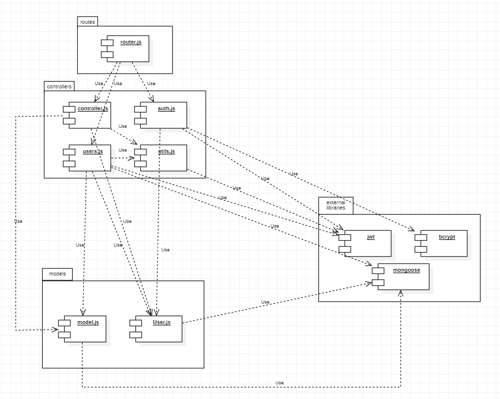
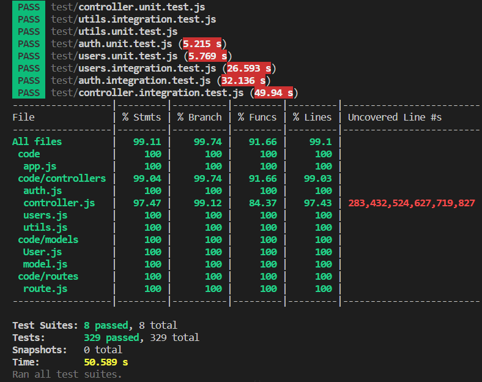

# Test Report

## Contents

-   [Dependency graph](#dependency-graph)

-   [Integration approach](#integration-approach)

-   [Tests](#tests)

-   [Coverage](#coverage-white-box)

## Dependency graph

## Integration approach

For all the integration tests we applied a _bottom up_ approach, in which we started testing simpler functionalities on the unit testing side, and then worked our way up integrating these individually tried functionalities to an integrated situation, where the API and routes were tested. The steps followed are summarised in the following list.

1. We tested the `models` independently of the functionalities that are inside the `controllers` folder. We began by testing the `verifyAuth` method.
2. In the unit testing we independently tested the functions that manipulated these models. In order to do this, we mocked all the functions that where called inside the function currently being tested by using the `jest` library.
3. We integrated all unit tests into an integration test, in which we called the functions via the API and the routes implemented. In order to do this we created a mock database to test functionalities of the system as a whole, calling the API as any real user would.

## Tests

| Test case name                                                                                                                                       | Object(s) tested                     | Test level  | Technique used        |
| ---------------------------------------------------------------------------------------------------------------------------------------------------- | ------------------------------------ | ----------- | --------------------- |
|                                                                                                                                                      | **getUsers**                         |             |                       |
| Should get the information of the user                                                                                                               |                                      | unit        | WB/ decision coverage |
| Should return an empty list                                                                                                                          |                                      | unit        | WB/ decision coverage |
| Should return a 401 error as user is not admin                                                                                                       |                                      | unit        | WB/ decision coverage |
| Should return error 500 as a server error                                                                                                            |                                      | unit        | WB/ decision coverage |
| Should return empty list if there are no users                                                                                                       |                                      | integration | BB/ bottom up         |
| Should retrieve list of all users                                                                                                                    |                                      | integration | BB/ bottom up         |
| Should have status 401, as the soliciting user is not an admin                                                                                       |                                      | integration | BB/ bottom up         |
|                                                                                                                                                      | **getUser**                          |             |                       |
| Should get the information of the user                                                                                                               |                                      | unit        | WB/ decision coverage |
| Should return status 400, and a message of user not found                                                                                            |                                      | unit        | WB/ decision coverage |
| Should return a 401 error as user is not admin                                                                                                       |                                      | unit        | WB/ decision coverage |
| Should return error 500 as a server error                                                                                                            |                                      | unit        | WB/ decision coverage |
| Should return the solicited user, by a request of an admin                                                                                           |                                      | integration | BB/ bottom up         |
| Should return the solicited user, by a request of the same user                                                                                      |                                      | integration | BB/ bottom up         |
| Should have status 400, as the user doesn't exist                                                                                                    |                                      | integration | BB/ bottom up         |
| Should have status 401, as the request is not by the same user as the one solicited, and is not an admin                                             |                                      | integration | BB/ bottom up         |
| Should return error 500 as a server error                                                                                                            |                                      | integration | BB/ bottom up         |
|                                                                                                                                                      | **createGroup**                      |             |                       |
| Should return status 200 and the created group                                                                                                       |                                      | unit        | WB/ decision coverage |
| Should return error 400, as a group with that name already exists                                                                                    |                                      | unit        | WB/ decision coverage |
| Should return error 400, as the request body is incomplete                                                                                           |                                      | unit        | WB/ decision coverage |
| Should return error 400, as one or more emails are on the wrong format                                                                               |                                      | unit        | WB/ decision coverage |
| Should return error 400, as the soliciting user is already on a Group                                                                                |                                      | unit        | WB/ decision coverage |
| Should return error 400, as the solicited members are already on a group                                                                             |                                      | unit        | WB/ decision coverage |
| Should return error 401, because of an authentication error                                                                                          |                                      | unit        | WB/ decision coverage |
| Should return error 400, as the solicited members do not exist                                                                                       |                                      | unit        | WB/ decision coverage |
| Should return error 500, because of a server error                                                                                                   |                                      | unit        | WB/ decision coverage |
| Should return a created group                                                                                                                        |                                      | integration | BB/ bottom up         |
| Should return status 400, as the body is incomplete                                                                                                  |                                      | integration | BB/ bottom up         |
| Should return status 401, as the cookies are incorrect                                                                                               |                                      | integration | BB/ bottom up         |
| Should return status 400, as one of the emails on the body is written incorrectly                                                                    |                                      | integration | BB/ bottom up         |
| Should return status 400, as there is already another group with the solicited name                                                                  |                                      | integration | BB/ bottom up         |
| Should return status 400, as the user requesting the creation already belongs to another group                                                       |                                      | integration | BB/ bottom up         |
| Should return status 400, as the solicited members are already on a group                                                                            |                                      | integration | BB/ bottom up         |
| Should return status 400, as the solicited members do not exist                                                                                      |                                      | integration | BB/ bottom up         |
| Should return status 400, as one solicited members do not exist and the other is in another group                                                    |                                      | integration | BB/ bottom up         |
|                                                                                                                                                      | **getGroups**                        |             |                       |
| Should retrieve list of all the groups                                                                                                               |                                      | unit        | WB/ decision coverage |
| Should return error 401, because of an authentication error                                                                                          |                                      | unit        | WB/ decision coverage |
| Should return error 500, because of a server error                                                                                                   |                                      | unit        | WB/ decision coverage |
| Should return empty list if there are no groups                                                                                                      |                                      | integration | BB/ bottom up         |
| Should return the list of the groups                                                                                                                 |                                      | integration | BB/ bottom up         |
| Should return status 401, as the soliciting user is not an admin                                                                                     |                                      | integration | BB/ bottom up         |
|                                                                                                                                                      | **getGroup**                         |             |                       |
| Should retrieve list of the solicited group                                                                                                          |                                      | unit        | WB/ decision coverage |
| Should return status 400, as the requested group doesn't exist                                                                                       |                                      | unit        | WB/ decision coverage |
| Should return status 401, as the verification isn't correct                                                                                          |                                      | unit        | WB/ decision coverage |
| Should return error 500, because of a server error                                                                                                   |                                      | unit        | WB/ decision coverage |
| Should return the solicited group, solicited by a member user                                                                                        |                                      | integration | BB/ bottom up         |
| Should return status 400, as the group doesn't exist                                                                                                 |                                      | integration | BB/ bottom up         |
| Should return status 401, as the soliciting user is neither in the group or an admin                                                                 |                                      | integration | BB/ bottom up         |
|                                                                                                                                                      | **addToGroup**                       |             |                       |
| Should add the members to the group                                                                                                                  |                                      | unit        | WB/ decision coverage |
| Should have status 400, as requested group doesn't exist                                                                                             |                                      | unit        | WB/ decision coverage |
| Should have status 400, as the body doesn't contain any mails                                                                                        |                                      | unit        | WB/ decision coverage |
| Should return status 400, as one email is wrongly written                                                                                            |                                      | unit        | WB/ decision coverage |
| Should return status 400, as all the members are already on a group                                                                                  |                                      | unit        | WB/ decision coverage |
| Should return status 400, as the members doesn't exist                                                                                               |                                      | unit        | WB/ decision coverage |
| Should return error 500, because of a server error                                                                                                   |                                      | unit        | WB/ decision coverage |
| Should add the users listed to the group Family                                                                                                      |                                      | integration | BB/ bottom up         |
| Should add the users listed to the group Family, as requested by an admin                                                                            |                                      | integration | BB/ bottom up         |
| Should return status 400, as the group doesn't exist                                                                                                 |                                      | integration | BB/ bottom up         |
| Should return status 400, as the request body is incomplete                                                                                          |                                      | integration | BB/ bottom up         |
| Should return status 401, as the soliciting user is neither in the group or an admin                                                                 |                                      | integration | BB/ bottom up         |
| Should return status 400, as one of the emails is wrongly written                                                                                    |                                      | integration | BB/ bottom up         |
| Should return status 400, as the solicited users doesn't exist                                                                                       |                                      | integration | BB/ bottom up         |
| Should return status 400, as the solicited users already are on another group                                                                        |                                      | integration | BB/ bottom up         |
| Should return status 400, as the solicited users already are on another group or doesn't exist                                                       |                                      | integration | BB/ bottom up         |
|                                                                                                                                                      | **removeFromGroup**                  |             |                       |
| Should remove the members from the group                                                                                                             |                                      | unit        | WB/ decision coverage |
| Should have status 400, as requested group doesn't exist                                                                                             |                                      | unit        | WB/ decision coverage |
| Should have status 400, as the body doesn't contain any mails                                                                                        |                                      | unit        | WB/ decision coverage |
| Should return status 400, as one email is wrongly written                                                                                            |                                      | unit        | WB/ decision coverage |
| Should return status 400, as there is only one member on the group and can't be removed                                                              |                                      | unit        | WB/ decision coverage |
| Should return status 400, as all the members are not on the solicited group                                                                          |                                      | unit        | WB/ decision coverage |
| Should return status 400, as the members doesn't exist                                                                                               |                                      | unit        | WB/ decision coverage |
| Should return status 500, because of a server error                                                                                                  |                                      | unit        | WB/ decision coverage |
| Should remove the users listed to the group Family                                                                                                   |                                      | integration | BB/ bottom up         |
| Should remove the users listed to the group Family, as requested by a admin                                                                          |                                      | integration | BB/ bottom up         |
| Should return status 400, as the group doesn't exist                                                                                                 |                                      | integration | BB/ bottom up         |
| Should return status 400, as the request body is incomplete                                                                                          |                                      | integration | BB/ bottom up         |
| Should return status 401, as the soliciting user is neither in the group or an admin                                                                 |                                      | integration | BB/ bottom up         |
| Should return status 400, as one of the emails on the body is wrongly written                                                                        |                                      | integration | BB/ bottom up         |
| Should return status 400, as there is only one member on the group, and can't be removed                                                             |                                      | integration | BB/ bottom up         |
| Should return status 400, as all the solicited users are not in the group                                                                            |                                      | integration | BB/ bottom up         |
| Should return status 400, as all the solicited users do not exist                                                                                    |                                      | integration | BB/ bottom up         |
| Should return status 400, as all the solicited users do not exist or are in another group                                                            |                                      | integration | BB/ bottom up         |
|                                                                                                                                                      | **deleteUser**                       |             |                       |
| Should deleted the user from the database, that isn't a member of a group                                                                            |                                      | unit        | WB/ decision coverage |
| Should deleted the user from the database, that is a member of a group                                                                               |                                      | unit        | WB/ decision coverage |
| Should return status 400, as user is an admin                                                                                                        |                                      | unit        | WB/ decision coverage |
| Should return status 400, as the request body is incomplete                                                                                          |                                      | unit        | WB/ decision coverage |
| Should return status 400, as user doesn't exist                                                                                                      |                                      | unit        | WB/ decision coverage |
| Should return status 500, because of a server error                                                                                                  |                                      | unit        | WB/ decision coverage |
| Should delete the solicited user                                                                                                                     |                                      | integration | BB/ bottom up         |
| Should delete the solicited user, and remove him from the group                                                                                      |                                      | integration | BB/ bottom up         |
| Should delete the solicited user, and remove his transactions                                                                                        |                                      | integration | BB/ bottom up         |
| Should return status 401, as the soliciting user is not an admin                                                                                     |                                      | integration | BB/ bottom up         |
| Should return status 400, as the request body has an incorrect mail format                                                                           |                                      | integration | BB/ bottom up         |
| Should return status 400, as the requested user doesn't exist                                                                                        |                                      | integration | BB/ bottom up         |
| Should return status 400, as the requested user is an Admin                                                                                          |                                      | integration | BB/ bottom up         |
| Should delete the solicited user, and delete the group                                                                                               |                                      | integration | BB/ bottom up         |
|                                                                                                                                                      | **deleteGroup**                      |             |                       |
| Should delete the group from the mockGroups                                                                                                          |                                      | unit        | WB/ decision coverage |
| Should return status 400, as group doesn't exist                                                                                                     |                                      | unit        | WB/ decision coverage |
| Should return status 400, as the body is incomplete                                                                                                  |                                      | unit        | WB/ decision coverage |
| Should return status 500, because of a server error                                                                                                  |                                      | unit        | WB/ decision coverage |
| Should delete the group                                                                                                                              |                                      | integration | BB/ bottom up         |
| Should return status 400, as the group doesn't exist                                                                                                 |                                      | integration | BB/ bottom up         |
| Should return status 400, as the body is incomplete                                                                                                  |                                      | integration | BB/ bottom up         |
| Should return status 401, as the requesting user is not an admin                                                                                     |                                      | integration | BB/ bottom up         |
|                                                                                                                                                      | **register**                         |             |                       |
| should return a 400 error if missing required parameter                                                                                              |                                      | unit        | WB/ node coverage     |
| should return a 400 error if at least one of the request body parameters is an empty string                                                          |                                      | unit        | WB/ node coverage     |
| should return a 400 error if missing required parameter                                                                                              |                                      | unit        | WB/ node coverage     |
| should return a 400 error when the email format is wrong                                                                                             |                                      | unit        | WB/ node coverage     |
| should return a 400 error if another account with the same username/email is already registered                                                      |                                      | unit        | WB/ node coverage     |
| should register a new user and return"User added successfully" message                                                                               |                                      | unit        | WB/ node coverage     |
| should return a 500 response                                                                                                                         |                                      | unit        | WB/ node coverage     |
| should register a new user                                                                                                                           |                                      | integration | BB/ partitioning      |
| should return an error if username or email already exists                                                                                           |                                      | integration | BB/ partitioning      |
| should return an error if email has wrong format                                                                                                     |                                      | integration | BB/ partitioning      |
| Incomplete request body                                                                                                                              |                                      | integration | BB/ partitioning      |
| Successful registration with valid inputs                                                                                                            |                                      | integration | BB/ partitioning      |
|                                                                                                                                                      | **registerAdmin**                    |             |                       |
| should return a 400 error if the request body is incomplete                                                                                          |                                      | unit        | WB/ node coverage     |
| should return a 400 error if at least one of the request body parameters is an empty string                                                          |                                      | unit        | WB/ node coverage     |
| should return a 400 error if the request body is incomplete                                                                                          |                                      | unit        | WB/ node coverage     |
| should return a 400 error when the email format is wrong                                                                                             |                                      | unit        | WB/ node coverage     |
| should return a 400 error if another admin account with the same username/email is already registered                                                |                                      | unit        | WB/ node coverage     |
| should register a new admin and return"success message"                                                                                              |                                      | unit        | WB/ node coverage     |
| should return a 500 response                                                                                                                         |                                      | unit        | WB/ node coverage     |
| Successful registration                                                                                                                              |                                      | integration | BB/ partitioning      |
| Incomplete request body                                                                                                                              |                                      | integration | BB/ partitioning      |
| Invalid email format                                                                                                                                 |                                      | integration | BB/ partitioning      |
| Existing username                                                                                                                                    |                                      | integration | BB/ partitioning      |
| Existing email                                                                                                                                       |                                      | integration | BB/ partitioning      |
| Successful registration with valid inputs                                                                                                            |                                      | integration | BB/ partitioning      |
|                                                                                                                                                      | **login**                            |             |                       |
| should return a 400 response if the request body is incomplete                                                                                       |                                      | unit        | WB/ node coverage     |
| should return a 400 response if the request body is incomplete                                                                                       |                                      | unit        | WB/ node coverage     |
| should return a 400 response if the request body is incomplete                                                                                       |                                      | unit        | WB/ node coverage     |
| should return a 400 error when the email format is wrong                                                                                             |                                      | unit        | WB/ node coverage     |
| should return a 400 response if there is no existing account with entered email                                                                      |                                      | unit        | WB/ node coverage     |
| should return a 400 response if the entered password is not right                                                                                    |                                      | unit        | WB/ node coverage     |
| should return a 500 response                                                                                                                         |                                      | unit        | WB/ node coverage     |
| Successful login                                                                                                                                     |                                      | integration | BB/ partitioning      |
| Incomplete request body                                                                                                                              |                                      | integration | BB/ partitioning      |
| Invalid email format                                                                                                                                 |                                      | integration | BB/ partitioning      |
| Non-existing email                                                                                                                                   |                                      | integration | BB/ partitioning      |
| Wrong password                                                                                                                                       |                                      | integration | BB/ partitioning      |
|                                                                                                                                                      | **logout**                           |             |                       |
| should return a 400 response if no refreshToken is provided                                                                                          |                                      | unit        | WB/ node coverage     |
| should return a 400 response if the user is not found                                                                                                |                                      | unit        | WB/ node coverage     |
| should return a 200 response and successfully log out the user                                                                                       |                                      | unit        | WB/ node coverage     |
| should return a 500 response                                                                                                                         |                                      | unit        | WB/ node coverage     |
| Successful logout                                                                                                                                    |                                      | integration | BB/ partitioning      |
| Refresh token not found                                                                                                                              |                                      | integration | BB/ partitioning      |
| User not found                                                                                                                                       |                                      | integration | BB/ partitioning      |
|                                                                                                                                                      | **handleDateFilterParams**           |             |                       |
| returns an empty object when no date parameters are provided                                                                                         |                                      | unit        | WB/ node coverage     |
| throws an error if "date" parameter has an invalid value                                                                                             |                                      | unit        | WB/ node coverage     |
| throws an error if "from" parameter has an invalid value                                                                                             |                                      | unit        | WB/ node coverage     |
| throws an error if "upTo" parameter has an invalid value                                                                                             |                                      | unit        | WB/ node coverage     |
| throws an error if both "date" and ("from" or "to") parameters are present                                                                           |                                      | unit        | WB/ node coverage     |
| returns a mongoose query for exact date filtering                                                                                                    |                                      | unit        | WB/ node coverage     |
| returns a mongoose query for filtering from a specific date                                                                                          |                                      | unit        | WB/ node coverage     |
| returns a mongoose query for filtering up to a specific date                                                                                         |                                      | unit        | WB/ node coverage     |
| throws an error for an invalid date range                                                                                                            |                                      | unit        | WB/ node coverage     |
| returns a mongoose query for a valid date range                                                                                                      |                                      | unit        | WB/ node coverage     |
| should return an empty object when no date parameters are provided                                                                                   |                                      | integration | BB/ partitioning      |
| should throw an error for invalid date parameter                                                                                                     |                                      | integration | BB/ partitioning      |
| should throw an error for conflicting date parameters                                                                                                |                                      | integration | BB/ partitioning      |
| should return query for specific date                                                                                                                |                                      | integration | BB/ partitioning      |
| should return query for date range [from, +infinity]                                                                                                 |                                      | integration | BB/ partitioning      |
| should return query for date range [-infinity, upTo]                                                                                                 |                                      | integration | BB/ partitioning      |
| should return query for valid date range [from, upTo]                                                                                                |                                      | integration | BB/ partitioning      |
| should throw an error for invalid date range                                                                                                         |                                      | integration | BB/ partitioning      |
|                                                                                                                                                      | **handleAmountFilterParams**         |             |                       |
| returns an empty object if no amount parameters are passed                                                                                           |                                      | unit        | WB/ node coverage     |
| throws an error if "min" parameter is not a number                                                                                                   |                                      | unit        | WB/ node coverage     |
| throws an error if "max" parameter is not a number                                                                                                   |                                      | unit        | WB/ node coverage     |
| returns the correct query object for range [min, +infinity]                                                                                          |                                      | unit        | WB/ node coverage     |
| returns the correct query object for range [-infinity, max]                                                                                          |                                      | unit        | WB/ node coverage     |
| throws an error for an invalid amount range [min, max]                                                                                               |                                      | unit        | WB/ node coverage     |
| returns the correct query object for a valid amount range [min, max]                                                                                 |                                      | unit        | WB/ node coverage     |
| should return an empty object when no amount parameters are provided                                                                                 |                                      | integration | BB/ partitioning      |
| should throw an error for invalid min parameter                                                                                                      |                                      | integration | BB/ partitioning      |
| should throw an error for invalid max parameter                                                                                                      |                                      | integration | BB/ partitioning      |
| should return query for min amount                                                                                                                   |                                      | integration | BB/ partitioning      |
| should return query for max amount                                                                                                                   |                                      | integration | BB/ partitioning      |
| should return query for valid amount range                                                                                                           |                                      | integration | BB/ partitioning      |
| should throw an error for invalid amount range                                                                                                       |                                      | integration | BB/ partitioning      |
|                                                                                                                                                      | **verifyAuth**                       |             |                       |
| returns false if one of the tokens is missing                                                                                                        |                                      | unit        | WB/ node coverage     |
| returns false if either token is missing information                                                                                                 |                                      | unit        | WB/ node coverage     |
| returns false if tokens do not match                                                                                                                 |                                      | unit        | WB/ node coverage     |
| returns false if the username does not match the requested user for authType "User"                                                                  |                                      | unit        | WB/ node coverage     |
| returns true if the username matches the requested user for authType "User"                                                                          |                                      | unit        | WB/ node coverage     |
| returns false if the role is not "Admin" for authType "Admin"                                                                                        |                                      | unit        | WB/ node coverage     |
| returns true if the role is "Admin" for authType "Admin"                                                                                             |                                      | unit        | WB/ node coverage     |
| returns false if the email is not in the requested group for authType "Group"                                                                        |                                      | unit        | WB/ node coverage     |
| returns true if the email is in the requested group for authType "Group"                                                                             |                                      | unit        | WB/ node coverage     |
| returns false if access token and refresh token are both expired                                                                                     |                                      | unit        | WB/ node coverage     |
| returns true and refreshes the access token if it has expired but the refresh token is still valid                                                   |                                      | unit        | WB/ node coverage     |
| should return false if at least one token is missing                                                                                                 |                                      | integration | BB/ partitioning      |
| should return false if at least one property of accessToken is missing                                                                               |                                      | integration | BB/ partitioning      |
| should return false if at least one property of refreshToken is missing                                                                              |                                      | integration | BB/ partitioning      |
| should return false if at least one of the variables\' value of accessToken and refreshToken doesn\'t match                                          |                                      | integration | BB/ partitioning      |
| should return true if a user try to verify him/herself                                                                                               |                                      | integration | BB/ partitioning      |
| should return false if a user try to access verifyAuth with other user\'s username                                                                   |                                      | integration | BB/ partitioning      |
| should return true if an admin try to verify                                                                                                         |                                      | integration | BB/ partitioning      |
| should return false if a non-admin user try to verify with admin privilege                                                                           |                                      | integration | BB/ partitioning      |
| should return true if a member of the group try to reach group specific functions                                                                    |                                      | integration | BB/ partitioning      |
| should return false if a user non-included in the group try to reach group specific functions                                                        |                                      | integration | BB/ partitioning      |
| should return true in case of Simple or default authentication                                                                                       |                                      | integration | BB/ partitioning      |
| should return false in case of a General Error                                                                                                       |                                      | integration | BB/ partitioning      |
| should return false in case of a General Error                                                                                                       |                                      | integration | BB/ partitioning      |
| should return false in case of TokenExpiredError happens twice                                                                                       |                                      | integration | BB/ partitioning      |
| should return false in case of accessToken expired and at least one of the refreshToken properties is missing                                        |                                      | integration | BB/ partitioning      |
| in case of accessToken expired but refreshToken is ok, should return true if a user try to verify him/herself                                        |                                      | integration | BB/ partitioning      |
| in case of accessToken expired but refreshToken is ok, should return false if a user try to access other users\'s data                               |                                      | integration | BB/ partitioning      |
| in case of accessToken expired but refreshToken is ok, should return true if an admin try to verify                                                  |                                      | integration | BB/ partitioning      |
| in case of accessToken expired but refreshToken is ok, should return false if a non-admin user try to verify                                         |                                      | integration | BB/ partitioning      |
| in case of accessToken expired but refreshToken is ok, should return true if a member of the group try to reach group specific functions             |                                      | integration | BB/ partitioning      |
| in case of accessToken expired but refreshToken is ok, should return false if a user non-included in the group try to reach group specific functions |                                      | integration | BB/ partitioning      |
| in case of accessToken expired but refreshToken is ok, should return true in case of Simple or default authentication                                |                                      | integration | BB/ partitioning      |
|                                                                                                                                                      | **createCategory**                   |             |                       |
| returns 401 if user is not an admin                                                                                                                  |                                      | unit        | WB/ node coverage     |
| returns 400 if request body is incomplete                                                                                                            |                                      | unit        | WB/ node coverage     |
| returns 400 if category of the same type already exists                                                                                              |                                      | unit        | WB/ node coverage     |
| creates a new category and returns it in the response                                                                                                |                                      | unit        | WB/ node coverage     |
| returns 500 if an error occurs                                                                                                                       |                                      | unit        | WB/ node coverage     |
| should return 401 if the user is not an admin                                                                                                        |                                      | integration | BB/ partitioning      |
| should create a new category when valid type and color are provided                                                                                  |                                      | integration | BB/ partitioning      |
| should return 400 if the category type already exists                                                                                                |                                      | integration | BB/ partitioning      |
| should return 400 if request body is incomplete                                                                                                      |                                      | integration | BB/ partitioning      |
|                                                                                                                                                      | **updateCategory**                   |             |                       |
| should update the category successfully                                                                                                              |                                      | unit        | WB/ node coverage     |
| should return an error if the user is not an admin                                                                                                   |                                      | unit        | WB/ node coverage     |
| should return an error if the request body is incomplete                                                                                             |                                      | unit        | WB/ node coverage     |
| should return an error if the new category type already exists                                                                                       |                                      | unit        | WB/ node coverage     |
| should return an error if an exception is thrown                                                                                                     |                                      | unit        | WB/ node coverage     |
| should return 401 error if the request is not from an admin                                                                                          |                                      | integration | BB/ partitioning      |
| should return 400 error if the request body is not complete                                                                                          |                                      | integration | BB/ partitioning      |
| should return 400 if the requested category does not exist                                                                                           |                                      | integration | BB/ partitioning      |
| should return 400 if the new requested category type already exists                                                                                  |                                      | integration | BB/ partitioning      |
| should update a category successfully and update the transactions                                                                                    |                                      | integration | BB/ partitioning      |
| should update a category successfully (only changing its color)                                                                                      |                                      | integration | BB/ partitioning      |
|                                                                                                                                                      | **deleteCategory**                   |             |                       |
| should return 401 status if user is not an admin                                                                                                     |                                      | unit        | WB/ node coverage     |
| should return 400 status if request body is incomplete                                                                                               |                                      | unit        | WB/ node coverage     |
| should return 400 status if there is only one category in the database                                                                               |                                      | unit        | WB/ node coverage     |
| should return an error if any element of "types" array is an empty string                                                                            |                                      | unit        | WB/ node coverage     |
| should return 400 status if a category to be deleted does not exist                                                                                  |                                      | unit        | WB/ node coverage     |
| should return 400 status if a category to be deleted does not exist                                                                                  |                                      | unit        | WB/ node coverage     |
| should return 401 error if the request is not from an admin                                                                                          |                                      | integration | BB/ partitioning      |
| should return 400 error if the request body is not complete                                                                                          |                                      | integration | BB/ partitioning      |
| should return 400 error if at least one type is empty                                                                                                |                                      | integration | BB/ partitioning      |
| should return 400 error if admin try to delete the only available category                                                                           |                                      | integration | BB/ partitioning      |
| should return 400 error if a non existing category type is sent in the request body                                                                  |                                      | integration | BB/ partitioning      |
| should return 200 and delete requested categories V1                                                                                                 |                                      | integration | BB/ partitioning      |
| should return 200 and delete requested categories V2(try to delete all categories)                                                                   |                                      | integration | BB/ partitioning      |
|                                                                                                                                                      | **getCategories**                    |             |                       |
| should return 401 status if user is not authorized                                                                                                   |                                      | unit        | WB/ node coverage     |
| should return all categories with status 200                                                                                                         |                                      | unit        | WB/ node coverage     |
| should return 401 if the user is not authorized                                                                                                      |                                      | integration | BB/ partitioning      |
|                                                                                                                                                      | **createTransaction**                |             |                       |
| should return 401 status if user is not authorized                                                                                                   |                                      | unit        | WB/ node coverage     |
| should return 400 status if request body is incomplete                                                                                               |                                      | unit        | WB/ node coverage     |
| should return 400 status if username in URL and request body do not match                                                                            |                                      | unit        | WB/ node coverage     |
| should return 400 status if requested user does not exist                                                                                            |                                      | unit        | WB/ node coverage     |
| should return 400 status if requested category type does not exist                                                                                   |                                      | unit        | WB/ node coverage     |
| should create a new transaction and return it with status 200                                                                                        |                                      | unit        | WB/ node coverage     |
| should return a 500 response                                                                                                                         |                                      | unit        | WB/ node coverage     |
| should return 401 if the request is not from a User                                                                                                  |                                      | integration | BB/ partitioning      |
| should return 400 if the request body is incomplete or the amount is not an integer                                                                  |                                      | integration | BB/ partitioning      |
| should return 400 if the username inserted in transaction does not match the users                                                                   |                                      | integration | BB/ partitioning      |
| should return 400 if the username inserted in transaction does not exist                                                                             |                                      | integration | BB/ partitioning      |
| should return 400 if the username inserted in transaction does not match the users                                                                   |                                      | integration | BB/ partitioning      |
| should return 400 if the requested category type does not exist                                                                                      |                                      | integration | BB/ partitioning      |
| should create a new transaction successfully                                                                                                         |                                      | integration | BB/ partitioning      |
|                                                                                                                                                      | **getAllTransactions**               |             |                       |
| should return 401 status if user is not an admin                                                                                                     |                                      | unit        | WB/ node coverage     |
| should return all transactions with category information with status 200                                                                             |                                      | unit        | WB/ node coverage     |
| should return a 500 response                                                                                                                         |                                      | unit        | WB/ node coverage     |
| should return 401 if a non-admin user try to perform this method                                                                                     |                                      | integration | BB/ partitioning      |
| should return all the users\' transactions to admin                                                                                                  |                                      | integration | BB/ partitioning      |
|                                                                                                                                                      | **getTransactionsByUser**            |             |                       |
| should return an error if the user is not authorized                                                                                                 |                                      | unit        | WB/ node coverage     |
| should return an error if the requested user does not exist                                                                                          |                                      | unit        | WB/ node coverage     |
| should return an empty array if no transactions are found for the user                                                                               |                                      | unit        | WB/ node coverage     |
| should return filtered transactions if query parameters are provided for a regular user                                                              |                                      | unit        | WB/ node coverage     |
| should handle errors and return a 500 status                                                                                                         |                                      | unit        | WB/ node coverage     |
| return a 401 error if a non-admin user try to access admin-only endpoint                                                                             |                                      | integration | BB/ partitioning      |
| should return 400 if the user does not exist                                                                                                         |                                      | integration | BB/ partitioning      |
| should return all transactions made by a specific user                                                                                               |                                      | integration | BB/ partitioning      |
|                                                                                                                                                      | **getTransactionsByUserByCategory**  |             |                       |
| returns 401 if regular user tries to access another user\'s transactions                                                                             |                                      | unit        | WB/ node coverage     |
| returns 401 if admin tries to access transactions without authorization                                                                              |                                      | unit        | WB/ node coverage     |
| returns 400 if requested user does not exist                                                                                                         |                                      | unit        | WB/ node coverage     |
| returns 400 if requested category does not exist                                                                                                     |                                      | unit        | WB/ node coverage     |
| returns transactions for the requested user and category                                                                                             |                                      | unit        | WB/ node coverage     |
| returns 500 if an error occurs during the process                                                                                                    |                                      | unit        | WB/ node coverage     |
| should return transactions by user and category                                                                                                      |                                      | integration | BB/ partitioning      |
| should return empty array if no transactions exist                                                                                                   |                                      | integration | BB/ partitioning      |
| should return error 400 if user does not exist                                                                                                       |                                      | integration | BB/ partitioning      |
| should return error 400 if category does not exist                                                                                                   |                                      | integration | BB/ partitioning      |
| should return error 401 if a regular user try to access admin-specific functions                                                                     |                                      | integration | BB/ partitioning      |
|                                                                                                                                                      | **getTransactionsByGroup**           |             |                       |
| should return an error if the requested group doesn't exist                                                                                          |                                      | unit        | WB/ node coverage     |
| should return an error if authorization check fails                                                                                                  |                                      | unit        | WB/ node coverage     |
| should return transactions data for the requested group                                                                                              |                                      | unit        | WB/ node coverage     |
| should handle errors and return a 500 response                                                                                                       |                                      | unit        | WB/ node coverage     |
| should return a 400 error if no group with the mentioned name exist                                                                                  |                                      | integration | BB/ partitioning      |
| should return an array of transactions made by members of a specific group                                                                           |                                      | integration | BB/ partitioning      |
| should return an empty array if there are no transactions made by the group                                                                          |                                      | integration | BB/ partitioning      |
| should return an error 401 if a non-member user try to retrieve group\'s transactions                                                                |                                      | integration | BB/ partitioning      |
|                                                                                                                                                      | **getTransactionsByGroupByCategory** |             |                       |
| should return an error if the requested group does not exist                                                                                         |                                      | unit        | WB/ node coverage     |
| should return an error if authentication fails                                                                                                       |                                      | unit        | WB/ node coverage     |
| should return an error if the requested category does not exist                                                                                      |                                      | unit        | WB/ node coverage     |
| should return an empty array if there are no transactions for the group with the specified category                                                  |                                      | unit        | WB/ node coverage     |
| should return the transactions made by the group with the specified category                                                                         |                                      | unit        | WB/ node coverage     |
| should handle unexpected errors and return a 500 status code                                                                                         |                                      | unit        | WB/ node coverage     |
| should return an array of transactions made by members of a specific group filtered by category                                                      |                                      | integration | BB/ partitioning      |
| should return 400 if the requested group does not exist                                                                                              |                                      | integration | BB/ partitioning      |
| should return 400 if the requested category does not exist                                                                                           |                                      | integration | BB/ partitioning      |
| should return 401 if the user is not authorized to access the endpoint                                                                               |                                      | integration | BB/ partitioning      |
|                                                                                                                                                      | **deleteTransaction**                |             |                       |
| should return an error if the user is not authorized                                                                                                 |                                      | unit        | WB/ node coverage     |
| should return an error if the request body is incomplete                                                                                             |                                      | unit        | WB/ node coverage     |
| should return an error if the user does not exist                                                                                                    |                                      | unit        | WB/ node coverage     |
| should return an error if the transaction does not exist                                                                                             |                                      | unit        | WB/ node coverage     |
| should return an error if the transaction does not belong to the user                                                                                |                                      | unit        | WB/ node coverage     |
| should delete the transaction and return a success message                                                                                           |                                      | unit        | WB/ node coverage     |
| should handle unexpected errors and return a 500 status code                                                                                         |                                      | unit        | WB/ node coverage     |
| should delete a transaction for an existing user                                                                                                     |                                      | integration | BB/ partitioning      |
| should return 401 if the requested transaction does not belong to the user                                                                           |                                      | integration | BB/ partitioning      |
| should return 400 if the transaction id is empty or not sent                                                                                         |                                      | integration | BB/ partitioning      |
| should return 400 if the requested transaction does not belong to the user, V2                                                                       |                                      | integration | BB/ partitioning      |
| should return 400 if the requested transaction does not exist                                                                                        |                                      | integration | BB/ partitioning      |
| should return 400 if the requested user does not exist                                                                                               |                                      | integration | BB/ partitioning      |
|                                                                                                                                                      | **deleteTransactions**               |             |                       |
| should return an error if the user is not authorized                                                                                                 |                                      | unit        | WB/ node coverage     |
| should return an error if the request body is incomplete                                                                                             |                                      | unit        | WB/ node coverage     |
| should return an error if at least one \_id is blank inside request body                                                                             |                                      | unit        | WB/ node coverage     |
| should return an error if at least one of the transactions does not exist                                                                            |                                      | unit        | WB/ node coverage     |
| should delete all requested transactions and return a success message                                                                                |                                      | unit        | WB/ node coverage     |
| should handle unexpected errors and return a 500 status code                                                                                         |                                      | unit        | WB/ node coverage     |
| should return 401 if a non-admin user try to access deleteTransactions                                                                               |                                      | integration | BB/ partitioning      |
| should return 400 if an element of \_ids is an empty string                                                                                          |                                      | integration | BB/ partitioning      |
| should return 400 if one or more of the requested transactions do not exist                                                                          |                                      | integration | BB/ partitioning      |
| should return 400 if the request body is incomplete                                                                                                  |                                      | integration | BB/ partitioning      |
| should delete multiple transactions identified by their ids                                                                                          |                                      | integration | BB/ partitioning      |

## Coverage of FR

| Functional Requirements covered | Test(s)                                                                                                  |
| ------------------------------- | -------------------------------------------------------------------------------------------------------- |
| FR1.1                           | should return a 400 error if missing required parameter                                                  |
|                                 | should return a 400 error if at least one of the request body parameters is an empty string              |
|                                 | should return a 400 error if missing required parameter                                                  |
|                                 | should return a 400 error when the email format is wrong                                                 |
|                                 | should return a 400 error if another account with the same username/email is already registered          |
|                                 | should register a new user and return"User added successfully" message                                   |
|                                 | should register a new user                                                                               |
|                                 | should return an error if username or email already exists                                               |
|                                 | should return an error if email has wrong format                                                         |
|                                 | Incomplete request body                                                                                  |
|                                 | Successful registration with valid inputs                                                                |
|                                 | should return a 500 response                                                                             |
| FR1.2                           | should return a 400 response if the request body is incomplete                                           |
|                                 | should return a 400 response if the request body is incomplete                                           |
|                                 | should return a 400 response if the request body is incomplete                                           |
|                                 | should return a 400 error when the email format is wrong                                                 |
|                                 | should return a 400 response if there is no existing account with entered email                          |
|                                 | should return a 400 response if the entered password is not right                                        |
|                                 | Successful login                                                                                         |
|                                 | Incomplete request body                                                                                  |
|                                 | Invalid email format                                                                                     |
|                                 | Non-existing email                                                                                       |
|                                 | Wrong password                                                                                           |
|                                 | should return a 500 response                                                                             |
| FR1.3                           | should return a 400 response if no refreshToken is provided                                              |
|                                 | should return a 400 response if the user is not found                                                    |
|                                 | should return a 200 response and successfully log out the user                                           |
|                                 | Successful logout                                                                                        |
|                                 | Refresh token not found                                                                                  |
|                                 | User not found                                                                                           |
|                                 | should return a 500 response                                                                             |
| FR1.4                           | should return a 400 error if the request body is incomplete                                              |
|                                 | should return a 400 error if at least one of the request body parameters is an empty string              |
|                                 | should return a 400 error if the request body is incomplete                                              |
|                                 | should return a 400 error when the email format is wrong                                                 |
|                                 | should return a 400 error if another admin account with the same username/email is already registered    |
|                                 | should register a new admin and return"success message"                                                  |
|                                 | Successful registration                                                                                  |
|                                 | Incomplete request body                                                                                  |
|                                 | Invalid email format                                                                                     |
|                                 | Existing username                                                                                        |
|                                 | Existing email                                                                                           |
|                                 | Successful registration with valid inputs                                                                |
|                                 | should return a 500 response                                                                             |
| FR1.5                           | Should get the information of the user                                                                   |
|                                 | Should return an empty list                                                                              |
|                                 | Should return a 401 error as user is not admin                                                           |
|                                 | Should return error 500 as a server error                                                                |
|                                 | Should return empty list if there are no users                                                           |
|                                 | Should retrieve list of all users                                                                        |
|                                 | Should have status 401, as the soliciting user is not an admin                                           |
| FR1.6                           | Should get the information of the user                                                                   |
|                                 | Should return status 400, and a message of user not found                                                |
|                                 | Should return a 401 error as user is not admin                                                           |
|                                 | Should return error 500 as a server error                                                                |
|                                 | Should return the solicited user, by a request of an admin                                               |
|                                 | Should return the solicited user, by a request of the same user                                          |
|                                 | Should have status 400, as the user doesn't exist                                                        |
|                                 | Should have status 401, as the request is not by the same user as the one solicited, and is not an admin |
|                                 | Should return error 500 as a server error                                                                |
| FR1.7                           | Should deleted the user from the database, that isn't a member of a group                                |
|                                 | Should deleted the user from the database, that is a member of a group                                   |
|                                 | Should return status 400, as user is an admin                                                            |
|                                 | Should return status 400, as the request body is incomplete                                              |
|                                 | Should return status 400, as user doesn't exist                                                          |
|                                 | Should return status 500, because of a server error                                                      |
|                                 | Should delete the solicited user                                                                         |
|                                 | Should delete the solicited user, and remove him from the group                                          |
|                                 | Should delete the solicited user, and remove his transactions                                            |
|                                 | Should return status 401, as the soliciting user is not an admin                                         |
|                                 | Should return status 400, as the request body has an incorrect mail format                               |
|                                 | Should return status 400, as the requested user doesn't exist                                            |
|                                 | Should return status 400, as the requested user is an Admin                                              |
|                                 | Should delete the solicited user, and delete the group                                                   |
| FR2.1                           | Should return status 200 and the created group                                                           |
|                                 | Should return error 400, as a group with that name already exists                                        |
|                                 | Should return error 400, as the request body is incomplete                                               |
|                                 | Should return error 400, as one or more emails are on the wrong format                                   |
|                                 | Should return error 400, as the soliciting user is already on a Group                                    |
|                                 | Should return error 400, as the solicited members are already on a group                                 |
|                                 | Should return error 401, because of an authentication error                                              |
|                                 | Should return error 400, as the solicited members do not exist                                           |
|                                 | Should return error 500, because of a server error                                                       |
|                                 | Should return a created group                                                                            |
|                                 | Should return status 400, as the body is incomplete                                                      |
|                                 | Should return status 401, as the cookies are incorrect                                                   |
|                                 | Should return status 400, as one of the emails on the body is written incorrectly                        |
|                                 | Should return status 400, as there is already another group with the solicited name                      |
|                                 | Should return status 400, as the user requesting the creation already belongs to another group           |
|                                 | Should return status 400, as the solicited members are already on a group                                |
|                                 | Should return status 400, as the solicited members do not exist                                          |
|                                 | Should return status 400, as one solicited members do not exist and the other is in another group        |
| FR2.2                           | Should retrieve list of all the groups                                                                   |
|                                 | Should return error 401, because of an authentication error                                              |
|                                 | Should return error 500, because of a server error                                                       |
|                                 | Should return empty list if there are no groups                                                          |
|                                 | Should return the list of the groups                                                                     |
|                                 | Should return status 401, as the soliciting user is not an admin                                         |
| FR2.3                           | Should retrieve list of the solicited group                                                              |
|                                 | Should return status 400, as the requested group doesn't exist                                           |
|                                 | Should return status 401, as the verification isn't correct                                              |
|                                 | Should return error 500, because of a server error                                                       |
|                                 | Should return the solicited group, solicited by a member user                                            |
|                                 | Should return status 400, as the group doesn't exist                                                     |
|                                 | Should return status 401, as the soliciting user is neither in the group or an admin                     |
| FR2.4                           | Should add the members to the group                                                                      |
|                                 | Should have status 400, as requested group doesn't exist                                                 |
|                                 | Should have status 400, as the body doesn't contain any mails                                            |
|                                 | Should return status 400, as one email is wrongly written                                                |
|                                 | Should return status 400, as all the members are already on a group                                      |
|                                 | Should return status 400, as the members doesn't exist                                                   |
|                                 | Should return error 500, because of a server error                                                       |
|                                 | Should add the users listed to the group Family                                                          |
|                                 | Should add the users listed to the group Family, as requested by an admin                                |
|                                 | Should return status 400, as the group doesn't exist                                                     |
|                                 | Should return status 400, as the request body is incomplete                                              |
|                                 | Should return status 401, as the soliciting user is neither in the group or an admin                     |
|                                 | Should return status 400, as one of the emails is wrongly written                                        |
|                                 | Should return status 400, as the solicited users doesn't exist                                           |
|                                 | Should return status 400, as the solicited users already are on another group                            |
|                                 | Should return status 400, as the solicited users already are on another group or doesn't exist           |
| FR2.6                           | Should remove the members from the group                                                                 |
|                                 | Should have status 400, as requested group doesn't exist                                                 |
|                                 | Should have status 400, as the body doesn't contain any mails                                            |
|                                 | Should return status 400, as one email is wrongly written                                                |
|                                 | Should return status 400, as there is only one member on the group and can't be removed                  |
|                                 | Should return status 400, as all the members are not on the solicited group                              |
|                                 | Should return status 400, as the members doesn't exist                                                   |
|                                 | Should return status 500, because of a server error                                                      |
|                                 | Should remove the users listed to the group Family                                                       |
|                                 | Should remove the users listed to the group Family, as requested by a admin                              |
|                                 | Should return status 400, as the group doesn't exist                                                     |
|                                 | Should return status 400, as the request body is incomplete                                              |
|                                 | Should return status 401, as the soliciting user is neither in the group or an admin                     |
|                                 | Should return status 400, as one of the emails on the body is wrongly written                            |
|                                 | Should return status 400, as there is only one member on the group, and can't be removed                 |
|                                 | Should return status 400, as all the solicited users are not in the group                                |
|                                 | Should return status 400, as all the solicited users do not exist                                        |
|                                 | Should return status 400, as all the solicited users do not exist or are in another group                |
| FR2.8                           | Should delete the group from the mockGroups                                                              |
|                                 | Should return status 400, as group doesn't exist                                                         |
|                                 | Should return status 400, as the body is incomplete                                                      |
|                                 | Should return status 500, because of a server error                                                      |
|                                 | Should delete the group                                                                                  |
|                                 | Should return status 400, as the group doesn't exist                                                     |
|                                 | Should return status 400, as the body is incomplete                                                      |
|                                 | Should return status 401, as the requesting user is not an admin                                         |
| FR3.1                           | should return 401 status if user is not authorized                                                       |
|                                 | should return 400 status if request body is incomplete                                                   |
|                                 | should return 400 status if username in URL and request body do not match                                |
|                                 | should return 400 status if requested user does not exist                                                |
|                                 | should return 400 status if requested category type does not exist                                       |
|                                 | should create a new transaction and return it with status 200                                            |
|                                 | should return 401 if the request is not from a User                                                      |
|                                 | should return 400 if the request body is incomplete or the amount is not an integer                      |
|                                 | should return 400 if the username inserted in transaction does not match the users                       |
|                                 | should return 400 if the username inserted in transaction does not exist                                 |
|                                 | should return 400 if the username inserted in transaction does not match the users                       |
|                                 | should return 400 if the requested category type does not exist                                          |
|                                 | should create a new transaction successfully                                                             |
|                                 | should return a 500 response                                                                             |
| FR3.2                           | should return 401 status if user is not an admin                                                         |
|                                 | should return all transactions with category information with status 200                                 |
|                                 | should return 401 if a non-admin user try to perform this method                                         |
|                                 | should return all the users\' transactions to admin                                                      |
|                                 | should return a 500 response                                                                             |
| FR3.3                           | should return an error if the user is not authorized                                                     |
|                                 | should return an error if the requested user does not exist                                              |
|                                 | should return an empty array if no transactions are found for the user                                   |
|                                 | should return filtered transactions if query parameters are provided for a regular user                  |
|                                 | should handle errors and return a 500 status                                                             |
|                                 | return a 401 error if a non-admin user try to access admin-only endpoint                                 |
|                                 | should return 400 if the user does not exist                                                             |
|                                 | should return all transactions made by a specific user                                                   |
|                                 | should return an empty object when no date parameters are provided                                       |
|                                 | should throw an error for invalid date parameter                                                         |
|                                 | should throw an error for conflicting date parameters                                                    |
|                                 | should return query for specific date                                                                    |
|                                 | should return query for date range [from, +infinity]                                                     |
|                                 | should return query for date range [-infinity, upTo]                                                     |
|                                 | should return query for valid date range [from, upTo]                                                    |
|                                 | should throw an error for invalid date range                                                             |
|                                 | should return an empty object when no amount parameters are provided                                     |
|                                 | should throw an error for invalid min parameter                                                          |
|                                 | should throw an error for invalid max parameter                                                          |
|                                 | should return query for min amount                                                                       |
|                                 | should return query for max amount                                                                       |
|                                 | should return query for valid amount range                                                               |
|                                 | should throw an error for invalid amount range                                                           |
| FR3.4                           | returns 401 if regular user tries to access another user's transactions                                  |
|                                 | returns 400 if requested user does not exist                                                             |
|                                 | returns 400 if requested category does not exist                                                         |
|                                 | returns transactions for the requested user and category                                                 |
|                                 | returns 500 if an error occurs during the process                                                        |
|                                 | should return transactions by user and category                                                          |
|                                 | should return empty array if no transactions exist                                                       |
|                                 | should return error 400 if user does not exist                                                           |
|                                 | should return error 400 if category does not exist                                                       |
|                                 | should return error 401 if a regular user try to access admin-specific functions                         |
| FR3.5                           | should return an error if the requested group doesn't exist                                              |
|                                 | should return an error if authorization check fails                                                      |
|                                 | should return transactions data for the requested group                                                  |
|                                 | should handle errors and return a 500 response                                                           |
|                                 | should return a 400 error if no group with the mentioned name exist                                      |
|                                 | should return an array of transactions made by members of a specific group                               |
|                                 | should return an empty array if there are no transactions made by the group                              |
|                                 | should return an error 401 if a non-member user try to retrieve group's transactions                     |
| FR3.6                           | should return an error if the requested group does not exist                                             |
|                                 | should return an error if authentication fails                                                           |
|                                 | should return an error if the requested category does not exist                                          |
|                                 | should return an empty array if there are no transactions for the group with the specified category      |
|                                 | should return the transactions made by the group with the specified category                             |
|                                 | should handle unexpected errors and return a 500 status code                                             |
|                                 | should return an array of transactions made by members of a specific group filtered by category          |
|                                 | should return 400 if the requested group does not exist                                                  |
|                                 | should return 400 if the requested category does not exist                                               |
|                                 | should return 401 if the user is not authorized to access the endpoint                                   |
| FR3.7                           | should return an error if the user is not authorized                                                     |
|                                 | should return an error if the request body is incomplete                                                 |
|                                 | should return an error if the user does not exist                                                        |
|                                 | should return an error if the transaction does not exist                                                 |
|                                 | should return an error if the transaction does not belong to the user                                    |
|                                 | should delete the transaction and return a success message                                               |
|                                 | should handle unexpected errors and return a 500 status code                                             |
|                                 | should delete a transaction for an existing user                                                         |
|                                 | should return 401 if the requested transaction does not belong to the user                               |
|                                 | should return 400 if the transaction id is empty or not sent                                             |
|                                 | should return 400 if the requested transaction does not belong to the user, V2                           |
|                                 | should return 400 if the requested transaction does not exist                                            |
|                                 | should return 400 if the requested user does not exist                                                   |
| FR3.8                           | should return an error if the user is not authorized                                                     |
|                                 | should return an error if the request body is incomplete                                                 |
|                                 | should return an error if at least one \_id is blank inside request body                                 |
|                                 | should return an error if at least one of the transactions does not exist                                |
|                                 | should delete all requested transactions and return a success message                                    |
|                                 | should handle unexpected errors and return a 500 status code                                             |
|                                 | should return 401 if a non-admin user try to access deleteTransactions                                   |
|                                 | should return 400 if an element of \_ids is an empty string                                              |
|                                 | should return 400 if one or more of the requested transactions do not exist                              |
|                                 | should return 400 if the request body is incomplete                                                      |
|                                 | should delete multiple transactions identified by their ids                                              |
| FR4.1                           | returns 401 if user is not an admin                                                                      |
|                                 | returns 400 if request body is incomplete                                                                |
|                                 | returns 400 if category of the same type already exists                                                  |
|                                 | creates a new category and returns it in the response                                                    |
|                                 | returns 500 if an error occurs                                                                           |
|                                 | should return 401 if the user is not an admin                                                            |
|                                 | should create a new category when valid type and color are provided                                      |
|                                 | should return 400 if the category type already exists                                                    |
|                                 | should return 400 if request body is incomplete                                                          |
| FR4.2                           | should update the category successfully                                                                  |
|                                 | should return an error if the user is not an admin                                                       |
|                                 | should return an error if the request body is incomplete                                                 |
|                                 | should return an error if the new category type already exists                                           |
|                                 | should return an error if an exception is thrown                                                         |
|                                 | should return 401 error if the request is not from an admin                                              |
|                                 | should return 400 error if the request body is not complete                                              |
|                                 | should return 400 if the requested category does not exist                                               |
|                                 | should return 400 if the new requested category type already exists                                      |
|                                 | should update a category successfully and update the transactions                                        |
|                                 | should update a category successfully (only changing its color)                                          |
| FR4.3                           | should return 401 status if user is not an admin                                                         |
|                                 | should return 400 status if request body is incomplete                                                   |
|                                 | should return 400 error if at least one type is empty                                                    |
|                                 | should return 400 error if admin try to delete the only available category                               |
|                                 | should return 400 error if a non existing category type is sent in the request body                      |
|                                 | should return 200 and delete requested categories V1                                                     |
|                                 | should return 200 and delete requested categories V2(try to delete all categories)                       |
|                                 | should return 400 status if there is only one category in the database                                   |
|                                 | should return an error if any element of "types" array is an empty string                                |
|                                 | should return 400 status if a category to be deleted does not exist                                      |
|                                 | should return 401 error if the request is not from an admin                                              |
|                                 | should return 400 error if the request body is not complete                                              |
|                                 | should return 400 status if a category to be deleted does not exist                                      |
| FR4.4                           | should return 401 status if user is not authorized                                                       |
|                                 | should return all categories with status 200                                                             |
|                                 | should return 401 if the user is not authorized                                                          |

## Coverage white box

